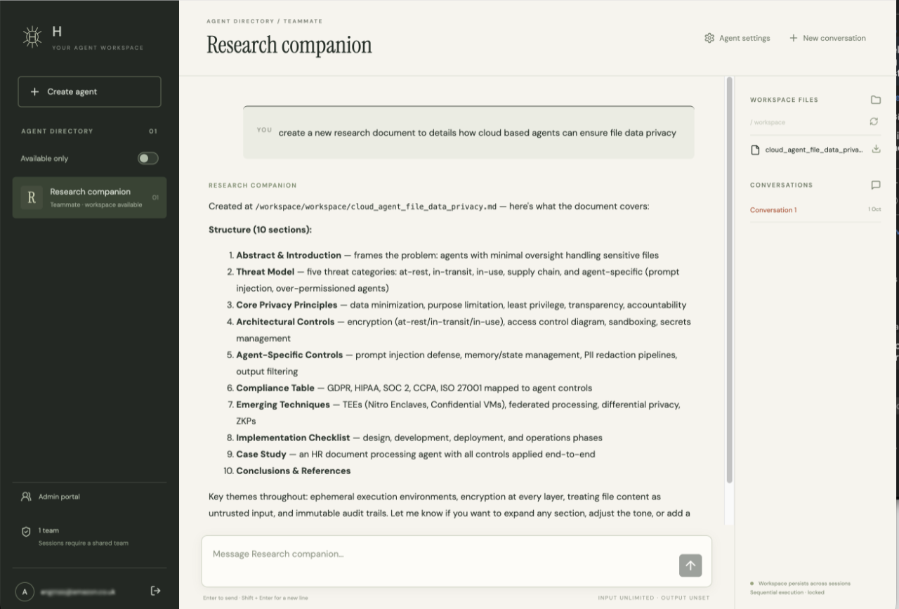

# Sandboxed agents on AgentCore

**A multi-tenant platform for persistent, tool-using AI agents. One AgentCore Runtime serves
every tenant's agent, and each agent runs real code in its own sandbox, with its own files and no
credentials. You deploy the whole thing with one CDK command.**

Your team signs in and creates agents. You chat with them, and they work for you: they run shell
commands, write and edit files, browse public websites and learn skills. Each agent keeps its
workspace, skills and memory between conversations. No agent can see another agent's files,
hold an AWS credential, or reach your private network.

[NousResearch Hermes](agents/hermes/) is the default agent. The platform harness does not depend
on any framework, so you can plug in your own with a single adapter.



> [!IMPORTANT]
> This is a sample reference implementation, not a formally audited security boundary. Before
> you adapt it, read the [isolation model and open security findings](docs/ISOLATION.md).

## Contents

- [Why this exists](#why-this-exists)
- [What you get](#what-you-get)
- [Example uses](#example-uses)
- [Architecture at a glance](#architecture-at-a-glance)
- [Deploy](#deploy)
- [Use the portal](#use-the-portal)
- [Configuration](#configuration)
- [Bring your own agent framework](#bring-your-own-agent-framework)
- [Portal behavior reference](#portal-behavior-reference)
- [Runtime behavior and limits](#runtime-behavior-and-limits)
- [Development and verification](#development-and-verification)
- [Troubleshooting](#troubleshooting)
- [Isolation probe](#isolation-probe)
- [Costs and clean-up](#costs-and-clean-up)

## Why this exists

A useful agent needs a computer: a shell, a file system, internet access and memory that lasts.
Give it one, and every prompt becomes a request to run untrusted code, including code that a
prompt injection planted. The question is how to give every tenant's assistant that computer
without letting it reach any other tenant's data.

### What you get from AgentCore Runtime

Amazon Bedrock AgentCore Runtime already solves the hardest part, isolating compute. Every
runtime session runs in its own **microVM**, with dedicated CPU, memory and a local file system.
Sessions never share a kernel or process space. When a session ends, AgentCore terminates the
microVM and sanitizes its memory. A runtime can also join your VPC, mount a persistent file
system such as Amazon EFS, and authenticate callers with a JWT authorizer.

So one conversation can never see another conversation's processes or local disk. For a
stateless agent, or an agent that serves a single tenant, that is all you need.

### Where AgentCore alone stops

Persistent, multi-tenant agents need state that outlives the session, and that state has to be
shared with the session somehow. In a single runtime that serves every tenant, all of its
sessions get the same configuration:

- **A shared file system.** Every session mounts the same EFS file system. The microVM keeps
  sessions apart from each other, but not from shared storage. Agent code in tenant A's session,
  or any tool it runs, can read `/mnt/agents/tenant-b/` as easily as its own directory.
- **Shared credentials.** Code in the microVM can use the runtime's IAM execution role. A tool
  that runs `aws dynamodb scan`, or reads the credentials from the environment, gets everything
  that the role allows, for every tenant.
- **Shared network access.** The session can reach anything its VPC subnets can reach: internal
  services, VPC endpoints, and the NFS port of the file system itself.

The agent framework is trusted to keep to its own tenant's data. Because the model decides what
the tools run, a single prompt injection is enough to break that trust.

### The obvious fix does not scale

With AgentCore alone, you can isolate tenants by giving **each one its own runtime**. Each
runtime has its own execution role and its own EFS access point, scoped to that tenant's
directory. That is sound, and it works for tens of agents. At a thousand agents, it becomes an
operational problem, and some platforms have millions of tenants:

- **Every code change is a fleet deployment.** A bug fix or a framework upgrade means updating
  a thousand runtimes, and then monitoring, retrying and rolling back each of them. Until the
  rollout finishes, tenants run different versions.
- **Every new tenant is an infrastructure change.** Creating an assistant means creating a
  runtime, an IAM role and an access point, inside the account's service quotas, instead of
  writing a database row.
- **Resource sprawl.** Thousands of roles, access points and endpoints have to be audited,
  tagged, and kept from drifting apart.

### What this solution adds

This solution keeps **one runtime and one image for every agent**, and adds isolation between
tenants _inside_ each AgentCore microVM:

| Layer           | AgentCore Runtime provides                                                      | This solution adds                                                                                                                                                                                                                                                                                         |
| --------------- | ------------------------------------------------------------------------------- | ---------------------------------------------------------------------------------------------------------------------------------------------------------------------------------------------------------------------------------------------------------------------------------------------------------- |
| **Compute**     | A dedicated microVM per session, with its own CPU, memory and local file system | A **bubblewrap sandbox** inside the microVM. The agent framework and its tools run with all namespaces, no capabilities and a seccomp filter. A trusted supervisor runs outside the sandbox.                                                                                                               |
| **File system** | An EFS mount that every session shares in full                                  | **Controlled sharing.** The supervisor binds only the calling agent's workspace, skills and memory into the sandbox, plus a private `/state` for the conversation. The agent is chosen from a verified token, never from a path in the request. Other agents' directories do not exist inside the sandbox. |
| **Credentials** | The execution role, available to all code in the microVM                        | **No credentials in the sandbox.** The supervisor holds the IAM role. A model broker calls Bedrock on the agent's behalf, with a fixed model and an output limit.                                                                                                                                          |
| **Network**     | Whatever the VPC subnets allow                                                  | **Brokered egress.** Direct networking is blocked. An egress broker allows HTTPS `CONNECT` only to public IPv4 addresses on port 443, so instance metadata, VPC services and NFS are out of reach.                                                                                                         |
| **Identity**    | A JWT authorizer on each invocation                                             | A **separate Cognito identity for every agent**. Its signed claims (team, execution mode, limits) are checked against every request, and each conversation is bound to one session.                                                                                                                        |

A tenant's assistant is then a set of records: a row in DynamoDB, a Cognito user and a directory
on EFS. Creating one is an API call, not a deployment. Updating the agent's code is a single
runtime update, and every assistant picks it up on its next session. Meanwhile, each assistant
keeps its own workspace, skills and memory files (`MEMORY.md`, `USER.md`, `SOUL.md`), so it
continues to evolve independently.

### What else it handles

Running persistent agents for many users raises a few more problems, which the solution also
handles:

| Problem                                                                                                     | How this solution handles it                                                                                                                                        |
| ----------------------------------------------------------------------------------------------------------- | ------------------------------------------------------------------------------------------------------------------------------------------------------------------- |
| **Leakage between teams.** A shared agent's memory can become a channel between teams.                      | Every agent belongs to exactly one team. Every conversation is private to the person who created it, and administrators cannot read it.                             |
| **Long-running work.** Agent turns can take minutes, but Lambda functions and browser connections time out. | A turn runs for up to an hour, independent of any request. Its progress is written to DynamoDB as durable events, and clients can disconnect and replay them later. |
| **Lost context.** A new session starts with an empty microVM.                                               | Workspaces, skills and memory persist on EFS. Each conversation's state is snapshotted and restored after a restart.                                                |
| **Framework lock-in.** Each framework needs its own hosting and security work.                              | A framework-independent harness owns the sandbox, brokers and event delivery. One adapter plugs in a framework.                                                     |

## What you get

- **A team portal.** A React app on CloudFront with an agent directory, streamed chat, a
  workspace file browser with downloads, and an admin console for humans, agents and teams.
- **Persistent agents.** Each agent has its own Cognito identity, an EFS workspace, shared
  skills and memory files, and settings such as execution mode and token limits.
- **Defense-in-depth isolation.** A microVM per conversation, a bubblewrap sandbox, brokered
  model and internet access, and token-verified identity on every invocation. The design was
  [verified on the managed AgentCore kernel](docs/ISOLATION.md#verification) before the portal was built.
- **Team-based access control.** Humans can belong to many teams. Agents belong to exactly one.
  Access is checked against live Cognito membership on every request.
- **Durable, resumable runs.** Turns are idempotent and survive closed tabs, Lambda timeouts
  and runtime restarts. AppSync Events delivers live updates to the browser.
- **Built-in observability.** OpenTelemetry traces of turns, model calls and tools go to
  CloudWatch Transaction Search. Traces record usage and correlation, never prompt contents.
- **Fully serverless and in code.** One CDK stack (`AgentSandboxPortal`) creates the VPC (or uses
  yours), AgentCore Runtime, EFS, Cognito, DynamoDB, Lambda, API Gateway, AppSync Events and
  CloudFront.

## Example uses

- **An assistant for every customer.** A software provider offers an AI assistant inside its
  product. Each customer creates their own, which learns that customer's preferences, keeps their
  documents and builds up skills. The provider maintains one agent codebase and deploys it once
  for every customer.
- **A research assistant for a team.** The analytics team creates a "Market research" agent.
  It browses public sources, saves its findings as Markdown and CSV files in its workspace, and
  learns a reporting skill. Next week, a teammate opens a new conversation, and the agent builds
  on the files and skills it already has. The finance team can see that the agent exists but
  cannot open it.
- **A developer companion.** An engineer asks an agent to download a public repository, run
  its tests and write a summary of the failures. The agent runs real commands in its sandbox,
  so a malicious dependency it installs cannot reach AWS credentials, instance metadata or
  other agents' files.
- **Long-running jobs.** You ask an agent to process a dataset and produce a report, then close
  your laptop. The run continues for up to an hour. When you come back, the portal replays
  everything the agent did and offers the result as a download.
- **A sandbox for security testing.** Red teams can create an agent in **Security test mode**
  to run adversarial prompts against a real tool-using agent. The mode is signed into the
  agent's identity and visible to the sandbox, but it never relaxes isolation.
- **A host for your own framework.** A platform team wants to offer agents built on another
  Python framework. They write an adapter under `agents/` and reuse the identity, isolation,
  persistence and streaming pipeline unchanged.

## Architecture at a glance


1. **Edge and identity.** CloudFront serves the React app from S3 and forwards `/api/*` to an
   API Gateway HTTP API. Humans sign in with Cognito. The browser holds only an HTTP-only session
   cookie, never a token.
2. **Accept.** The Commands Lambda (FastAPI) checks team membership and conversation ownership.
   It then writes the run, a reservation and the message to DynamoDB in one transaction.
3. **Dispatch.** A DynamoDB stream triggers the Dispatcher Lambda. It signs in as the agent's
   own Cognito identity and starts the turn on AgentCore Runtime.
4. **Execute.** Each conversation has its own AgentCore microVM. A trusted supervisor in the
   microVM runs the agent in a bubblewrap sandbox. The sandbox can see only its agent's EFS
   directory, and it reaches Bedrock and the public internet only through brokers.
5. **Stream.** The supervisor appends numbered events to DynamoDB. A Publisher Lambda sends
   "new event" hints over AppSync Events. The browser then fetches the events through the
   authorized replay API.

For the components, identities, the end-to-end flow, the state stores and the trust zones, read
[docs/ARCHITECTURE.md](docs/ARCHITECTURE.md). It also links to the deeper guides:

| Guide                                                           | Covers                                                         |
| --------------------------------------------------------------- | -------------------------------------------------------------- |
| [ARCHITECTURE.md](docs/ARCHITECTURE.md)                         | Components, identities, message flow, storage and trust zones  |
| [SERVERLESS.md](docs/SERVERLESS.md)                             | The durable run pipeline, retries, recovery and the client API |
| [HARNESS.md](docs/HARNESS.md)                                   | The supervisor, sandbox, brokers and adapter contract          |
| [ISOLATION.md](docs/ISOLATION.md)                               | Isolation layers, how they are verified, and open findings     |
| [OBSERVABILITY.md](docs/OBSERVABILITY.md)                       | Traces and CloudWatch queries                                  |
| [PRODUCT.md](PRODUCT.md), [TECH.md](specs/agent-portal/TECH.md) | Approved scope and technical design                            |

## Deploy

### Prerequisites

- Node.js 22+ and npm, Python 3.12+ with [uv](https://docs.astral.sh/uv/), AWS CLI v2, and
  Docker with buildx running. CDK builds the ARM64 runtime image locally.
- An AWS account and an EU Region where Amazon Bedrock AgentCore Runtime is available, such as
  `eu-west-1` or `eu-central-1`. The default model uses the EU cross-Region inference profile for
  Claude Sonnet 4.6. To deploy elsewhere, see [Change the model](#change-the-model).
- Access to the Anthropic Claude model enabled in Amazon Bedrock.
- CDK bootstrapped in the target account and Region (`npx cdk bootstrap`).
- Permissions to deploy VPC, EFS, IAM, Cognito, Lambda, CloudFront and AgentCore resources, and
  to publish CDK assets.

### 1. Install and build

```sh
npm ci
npm --prefix frontend ci
npm --prefix frontend run build
uv sync --locked
```

### 2. Deploy the stack

CDK uses the active AWS profile and Region. Set them first, for example:

```sh
export AWS_PROFILE=my-profile AWS_REGION=eu-west-1
```

**Option A: create a new VPC.** This is the simplest option. The stack creates a two-AZ VPC
with one NAT gateway.

```sh
npx cdk diff -c stage=portal
npx cdk deploy AgentSandboxPortal -c stage=portal
```

**Option B: use an existing VPC.** First run synth with only `vpcId`, so CDK caches the subnet
topology. Then deploy with explicit private subnet IDs:

```sh
npx cdk synth --quiet --strict -c stage=portal -c vpcId=VPC_ID
npx cdk diff -c stage=portal -c vpcId=VPC_ID -c subnetIds=SUBNET_A,SUBNET_B
npx cdk deploy AgentSandboxPortal -c stage=portal -c vpcId=VPC_ID -c subnetIds=SUBNET_A,SUBNET_B
```

Pass the same network context on every later deployment. Imported subnets need outbound HTTPS
access for the lifetime of the stack (a NAT gateway or equivalent; VPC endpoints alone are not
enough). They also need free IP addresses and EFS-supported Availability Zones. See
[Troubleshooting](#troubleshooting).

The first deployment takes several minutes, mostly to build the runtime image and create the
CloudFront distribution. When it finishes, the `PortalUrl` output contains the portal address,
in the form `https://dxxxxxxxxxxxxx.cloudfront.net/`.

### 3. Invite the first administrator

```sh
uv run python scripts/bootstrap_user.py --email YOU@EXAMPLE.COM --region eu-west-1
```

The script creates a **Default team**, invites you as a human and administrator, and prints the
portal URL. Add `--profile` if you do not use `AWS_PROFILE`. Cognito emails you a temporary
password, which you must change at first sign-in. The script never prints or stores a password.

## Use the portal

1. Open the `PortalUrl` and sign in.
2. Choose **Create agent**. Give it a name and a team, and optionally set the execution mode,
   input and output limits, and Security test mode.
3. Send a message. Replies stream in, and a **Latest work update** shows what the agent is
   doing while it uses tools.
4. Browse and download the agent's files in the **Workspace files** panel. Start a **New
   conversation** to see the agent keep its files and skills.
5. Open **Admin portal** to create teams, invite people, grant administrator access and move
   agents between teams.

Some prompts to try:

- _"Create a project plan for migrating a website to AWS and save it as `plan.md`."_
- _"Fetch the AWS What's New feed, summarize this week's AgentCore announcements, and save the
  summary as a file."_
- _"Write a Python script that generates a CSV of 100 rows of sample sales data, run it, and
  tell me the total revenue."_
- _"Remember that I prefer short answers with bullet points."_ Then ask a question in a new
  conversation.

## Configuration

Pass these as CDK context (`-c key=value`, unless noted) on every `synth`, `diff` and `deploy`:

| Context                 | Default                                               | Purpose                                                                                                                            |
| ----------------------- | ----------------------------------------------------- | ---------------------------------------------------------------------------------------------------------------------------------- |
| `stage=portal`          | (required)                                            | Selects the portal stack (`AgentSandboxPortal`). Without it, the app synthesizes the isolation probe.                              |
| `vpcId`, `subnetIds`    | create a new VPC                                      | Deploy into an existing VPC and its private subnets                                                                                |
| `agentImplementation`   | `hermes`                                              | The adapter directory under `agents/` to build into the runtime image, for example `echo`                                          |
| `modelId`, `modelAlias` | `eu.anthropic.claude-sonnet-4-6`, `claude-sonnet-4-6` | The Bedrock inference profile and the underlying model                                                                             |
| `mobileCallbackUrls`    | none                                                  | An array of OAuth callback URLs, set in the `context` of `cdk.json`. When set, the stack creates a Cognito client for native apps. |

### Change the model

The runtime IAM policy allows the configured inference profile in the stack's Region, and the
foundation model in the EU Regions that the EU profile routes to. To use another model or a
non-EU Region, change `modelId` and `modelAlias`, and update the destination-Region list in
[`infrastructure/portal-stack.ts`](infrastructure/portal-stack.ts) to match.

## Bring your own agent framework

The harness and the agent are separate:

| Component                                                 | Owns                                                                                                                    |
| --------------------------------------------------------- | ----------------------------------------------------------------------------------------------------------------------- |
| `runtime/` — platform harness                             | Sandbox lifecycle, model/egress proxies, worker protocol, optional lifecycle hooks, durable events and telemetry export |
| `agents/hermes/agent_adapter.py` — sandboxed agent        | Pinned Hermes, reasoning loop, tools, memory hooks, configuration and SQLite snapshot creation                          |
| `agents/hermes/lifecycle.py` — trusted Hermes integration | Hermes snapshot restoration and publication                                                                             |
| `runtime/contract.py` — adapter API                       | Turn results, streaming callbacks, token estimation and cleanup; no snapshot requirement                                |
| `backend/events.py` — event delivery                      | Dispatch, AppSync notification publishing and reconciliation                                                            |

To support another Python framework, add an adapter under `agents/` and select it at build time
with `-c agentImplementation=<directory>`. The included `agents/echo/` adapter completes durable
runs without Hermes dependencies or snapshots. Each agent implementation sets its own
persistence policy. See [the harness and adapter guide](docs/HARNESS.md#implement-an-adapter)
for the contract, lifecycle and build commands.

## Portal behavior reference

### Identity and sessions

The frontend is served by CloudFront/S3. `/api/*` goes through API Gateway HTTP API to
FastAPI/Mangum on Lambda. AppSync Events delivers live run notifications; authenticated HTTP
reads replay durable events from DynamoDB. Browser sessions use HTTP-only secure cookies;
PKCE verifiers are stored server-side. Cognito agent passwords live only in Secrets Manager.
All Cognito app clients explicitly allow self-service attribute writes only to `email`;
team membership and agent security/settings attributes require privileged administrative APIs.
Agent IDs derive from the selected team and a request UUID, preventing cross-team collisions.
The admin identity list resolves each `agent_<uuid>` Cognito username through DynamoDB and shows
the logical agent name, agent UUID, creator email (or creator Cognito sub), and assigned team.

### Teams and conversations

Humans can belong to multiple teams. Agents are visible in a global directory but belong to
exactly one team. Conversation creation, history, chat and artifacts require the human's current
Cognito `team_ids` claim to contain the agent's singular `team_id`. This asymmetric rule prevents
an agent's persistent memory or workspace from becoming a bridge between teams. The admin portal
at `#admin` manages Cognito humans, agents, teams, enabled status and administrator access.

Conversations are private to their human owner, including listing, history, runs, replay and
subscriptions. Shared team membership or administrator status does not grant another user's chat
access. Workspace artifacts, skill content, and the agent's MEMORY.md, USER.md and SOUL.md
are shared across the agent's conversations. Hermes logs, request dumps, and HOME live in private
session storage rather than the shared Hermes directory. Shared MEMORY.md, USER.md, and SOUL.md
are available through `/shared/agent` and the pinned Hermes adapter.

### Admin directory

Admin loads fetch teams and identities independently after authentication. Workspace requests are
deferred until returning to the workspace. Successful mutations update the affected rows directly;
the refresh button reloads only the selected directory. Cognito list attributes are reused, group
lookups share a four-worker pool, and agent identity mappings/metadata are read in DynamoDB batches.
Authorization still reads live membership on every request.

`DirectoryByType` indexes team and agent metadata by their existing `sk`/`pk` values. Only directory
display fields are projected; chat text and credentials are excluded. The index contains keys for
other record types too, but directory queries select only teams or agent metadata. Indexed directory
reads are eventually consistent; direct authorization reads remain strongly consistent, and mutation
responses provide immediate UI updates.

### Agent settings

Agent creation has an optional **Security test mode**. It persists on the agent and adds a signed
boolean claim to its Cognito access token. The runtime injects `SECURITY_TEST_MODE=true` only when
the invocation value exactly matches that claim. The setting cannot be toggled by prompt or
request payload and does not relax bubblewrap, seccomp, network, credential, or EFS isolation.

Agent creation and **Agent settings** expose independent input and output limits. Input can be
measured as roughly estimated tokens or UTF-8 MB; `0` disables the application input check. Output
is measured in tokens and passed as Hermes `max_tokens`; `0` passes `None`. Cognito signs all three
values into the agent token, and the runtime rejects payload mismatches. Platform HTTP limits and
native model limits remain in force.

Agent creation includes **Execution mode**, fixed for the lifetime of the agent:

- **Sequential (lock)** — default. One active turn across all conversations for the agent;
  DynamoDB admission and the EFS execution lock both serialize access.
- **Concurrent (no agent-wide lock)** — different private conversations may run at the same time.
  There is no agent-wide DynamoDB reservation or EFS execution lock. Concurrent turns can edit
  the same shared workspace/skills. A conversation-scoped DynamoDB reservation still orders its
  own turns, and per-run idempotency/ownership fencing remains in force.

The backend stores the choice and Cognito signs it into the agent token; a chat request cannot
override it. Use `scripts/execution_mode_ui_smoke.py` to verify the creation form with mocked APIs
and no AWS writes.

## Runtime behavior and limits

- `GET /ping` returns `HealthyBusy` while the supervisor's background producer is running.
  A short `start` invocation claims a durable run; client disconnects never cancel it.
- DynamoDB transactions reserve one run per agent in sequential mode, or per conversation in
  concurrent mode, fence writer ownership, and atomically persist events, cursors and terminal
  messages. Only sequential mode takes the EFS advisory lock for shared workspace writes.
- Run metadata, idempotency and replay events are retained for seven days. Final conversation
  history and SQLite checkpoints outlive replay retention. AppSync is not the replay store.
- One persistent AgentCore runtime session ID per conversation. Repeated turns reuse the same
  microVM until AgentCore suspends it after 15 idle minutes or reaches the 8-hour lifetime.
- One persistent bubblewrap worker, `SessionDB`, and `AIAgent` per AgentCore conversation session.
  Repeated turns reuse the same process and object until AgentCore stops the microVM.
- Conversation-specific EFS checkpoints restore the worker after an idle stop, maximum lifetime,
  deployment, crash, or fatal turn. This avoids stale cross-conversation database publication.
  Each session uses a private local SQLite database. Each completed durable turn publishes an
  immutable `/mnt/agents/.control/<agent-sub>/<conversation-id>.<run-id>.db` snapshot, and the
  committed conversation metadata pointer selects the authoritative file. A stale or interrupted
  run cannot promote its candidate. See [Hermes snapshots](docs/HARNESS.md#hermes-snapshots).
- Hermes commentary segments emitted before tool calls appear as one replaceable **Latest work
  update**, not concatenated into the final assistant message. Successful final text replaces it.
- Budget-limited, non-failed turns are checkpointed and persisted as partial responses with their
  exit reason instead of being converted into a fatal “Hermes turn did not complete” error.
- 20 model/tool iterations, configurable output tokens per model request, one-hour execution deadline.
- Artifacts and skills persist immediately on EFS; conversation checkpoints publish after
  completed turns. Interrupted turns may lose conversation state after the previous checkpoint.
- HTTP proxy supports public **HTTPS CONNECT on port 443**. Private/link-local addresses,
  direct network access and NFS access from agent code are blocked. Applications must honor
  HTTP(S)\_PROXY; arbitrary direct sockets intentionally cannot reach the internet.
- File downloads are capped at 32 MiB, transferred in ETag-pinned 2 MiB ranges through Lambda;
  file listings at 1000 entries, checkpoints at 64 MiB. Each final response is limited to
  300,000 UTF-8 bytes; larger results must be saved as workspace artifacts.
- The trusted supervisor, brokers and portal backend are privileged relative to the inner
  sandbox. This is a working reference implementation, not a formally audited security boundary.
  See [open security findings and isolation evidence](docs/ISOLATION.md#open-findings) for
  unresolved startup, background-execution and team-transfer issues.

## Development and verification

```sh
uv run pytest
uv run ruff check common runtime backend probe scripts tests
npm run typecheck
npm run test:infra
uv run --with playwright python -m playwright install chromium
uv run --with playwright python scripts/browser_smoke.py
```

For local admin UI regression checks, start `npm --prefix frontend run dev`, then run
`uv run --with playwright python scripts/admin_ui_smoke.py`. This uses mocked APIs and covers slow
or failed identity loads, single-request mutations, pending controls, and deferred workspace loading.

The browser test creates multi-team, same-team and unrelated test humans plus an agent. It
exercises Cognito claims, admin UI, global agent discovery, same-team session creation, cross-team
denial, real Bedrock tool execution, file download and persistence in another conversation. Test
humans are deleted afterward; synthetic agent artifacts are retained for inspection. Evidence and
screenshots go to `.deployment/`. Passwords and access tokens are not printed.

`scripts/local_runtime_smoke.py` can be mounted into the runtime container at `/app/smoke.py`
to test real Hermes/tool execution with a fake model response. Local Docker requires nested
namespace support; the live AgentCore runtime requires no privileged container configuration.

Agent tracing uses ADOT/OpenTelemetry, with service `agent-harness` in CloudWatch Transaction
Search and unified spans in the runtime-specific CloudWatch log group. It includes
turn/model/tool lifecycle spans, iteration/usage counts and run correlation without capturing
private prompts or responses. See [observability setup and queries](docs/OBSERVABILITY.md).

### Backend Lambda packaging

The five backend handlers (Commands, EventsAuthorizer, Dispatcher, Publisher, Reconciler) are
ARM64 Python 3.12 zip functions. They share one code asset with only `backend/` and `common/`,
plus one dependency layer (`infrastructure/lambda-bundling.ts`). The layer contains the `lambda`
dependency group from `pyproject.toml`, installed at the exact versions and hashes pinned in
`uv.lock`. `uv` selects `aarch64-manylinux2014` wheels whatever your build machine is, and refuses
source builds. If `uv` is not on `PATH`, synth falls back to doing the same install in the Lambda
build container (Docker). The layer is rebuilt only when `pyproject.toml` or `uv.lock` changes.

To change a backend dependency, add the package to the `lambda` group, then run `uv lock` and
redeploy. To upgrade a pinned version, run `uv lock --upgrade-package NAME`.

## Troubleshooting

### `/api/auth/login` (or any API call that reaches AWS) returns 500 after ~29 seconds

**Symptoms**

- `GET /api/auth/login` returns `{"message":"Internal Server Error"}` after about 29 seconds,
  while `GET /api/health` returns 200 straight away (it makes no AWS calls).
- The Commands Lambda log group (`AgentSandboxPortal-CommandsLogs…`) shows `Status: timeout` with no
  Python traceback.

**Cause**

The backend Lambda, the AgentCore runtime and EFS run in the selected private subnets. The login
handler writes a PKCE record to DynamoDB before redirecting to Cognito. If the subnets have no
outbound route, the call hangs until the Lambda times out and API Gateway returns 500. This
usually happens when you deploy with `-c vpcId=… -c subnetIds=…` and the VPC later loses its egress:

- The NAT gateway, internet gateway or private route table's `0.0.0.0/0` route was deleted.
- The VPC belonged to another stack (for example `AgentSandboxIsolationProbe`) that was destroyed. The
  delete removes the NAT, IGW, public subnets and route tables, then fails with `DELETE_FAILED`
  on the private subnets because the portal's network interfaces are still attached to them. The
  subnets stay in place, but they have only the `local` route.

**Diagnose**

```sh
VPC=vpc-EXAMPLE
aws ec2 describe-route-tables --filters Name=vpc-id,Values=$VPC \
  --query 'RouteTables[].{id:RouteTableId,subnets:Associations[].SubnetId,routes:Routes[].[DestinationCidrBlock,GatewayId||NatGatewayId]}'
aws ec2 describe-nat-gateways --filter Name=vpc-id,Values=$VPC --query 'NatGateways[].[NatGatewayId,State]'
aws ec2 describe-vpc-endpoints --filters Name=vpc-id,Values=$VPC --query 'VpcEndpoints[].ServiceName'
aws cloudformation list-stacks --stack-status-filter DELETE_FAILED
```

The selected subnets need a `0.0.0.0/0` route to an `available` NAT gateway (or an equivalent
egress path, such as a transit gateway or firewall). VPC endpoints alone are not enough: the
OAuth callback calls the Cognito hosted domain (`*.auth.<region>.amazoncognito.com`), which has
no PrivateLink endpoint.

**Fix**

- Restore egress in the imported VPC: a NAT gateway in a public subnet, plus a `0.0.0.0/0` route
  from the private subnets' route table. No redeploy is needed. Lambda picks up the new route
  on the next invocation.
- Alternatively, redeploy the portal without `vpcId`/`subnetIds` so it creates and owns a VPC
  with a NAT gateway. This replaces the security groups, EFS mount targets and Lambda/runtime
  network settings, so back up anything on EFS that you need first.

Do not import a VPC owned by a stack you plan to destroy. After you move the portal off such a
VPC, retry deleting the other stack to remove the leftover subnets and security groups.

## Isolation probe

The portal design was gated on a standalone probe that runs fixed diagnostics inside a real
AgentCore microVM. You do not need it to deploy the portal. Use it to re-check isolation on the
managed AgentCore kernel. The probe image is in `probe/`; the portal image (`runtime/Dockerfile`)
composes the harness and a separately installed agent adapter.

### Validate and deploy the probe

```sh
npm ci
uv sync --locked
npm run typecheck
npm run test:infra
uv run pytest
npm run synth
npm run diff
npm run deploy:probe
uv run python scripts/probe_runtime.py
```

CDK uses the active AWS profile/region. To override, set `AWS_PROFILE` and `AWS_REGION` or pass
`--profile` to CDK and `--profile/--region` to the probe runner. The runtime uses native EFS
mounting through the CloudFormation `FilesystemConfigurations` property. IAM authenticates
probe invocations; it must not be treated as the finished portal authentication flow.

To import a VPC, supply the VPC ID and optional private subnet IDs consistently to synth,
diff and deploy:

```sh
npx cdk deploy AgentSandboxIsolationProbe -c vpcId=vpc-EXAMPLE -c subnetIds=subnet-A,subnet-B
```

Imported subnets must have HTTPS egress, available addresses and EFS-supported Availability
Zones. The stack creates EFS mount targets in the selected subnets, one per Availability Zone.
The generated VPC uses one NAT gateway for the proof (not a multi-AZ production egress design).

### Local container test

```sh
docker buildx build --platform linux/arm64 --load -t agent-sandbox-isolation-probe probe
docker run --rm --platform linux/arm64 -p 127.0.0.1:8080:8080 agent-sandbox-isolation-probe
curl -fsS http://127.0.0.1:8080/ping
curl -fsS http://127.0.0.1:8080/invocations -H 'Content-Type: application/json' \
  -d '{"agent":"a","operation":"write","marker":"local-test"}'
```

Docker's default seccomp profile may block nested namespaces. A failed local launch is reported
as `passed:false`, not retried without isolation. A local success never substitutes for testing
the managed AgentCore kernel. Local endpoints have no authentication: bind loopback only.

### Probe evidence

The runner saves `.deployment/probe-result.json` and stops every session. An unsuccessful check
returns exit code 1. Three successful invocations must show single-directory access, private
namespaces, blocked direct networking/metadata, zero effective capabilities, no inherited
descriptors/credentials, denied mounts and a marker restored in a new microVM session.

Probe sessions idle out after 60 seconds and have a 10-minute maximum lifetime.

## Costs and clean-up

You pay for the AWS resources you deploy. The main costs are the NAT gateway (always on, when the
stack creates the VPC), AgentCore Runtime session time, Bedrock model tokens, EFS storage, and ECR
image storage. CloudFront, Lambda, DynamoDB, AppSync Events, Cognito and API Gateway are billed
by usage. Idle AgentCore sessions stop after 15 minutes.

To remove the portal, pass the same context that you deployed with:

```sh
npx cdk destroy AgentSandboxPortal -c stage=portal
```

To protect your data, the stack **retains** the EFS file system, both DynamoDB tables, the Cognito
user pool and the frontend S3 bucket when you delete it. Record their IDs from the stack resources
before you destroy it. Delete them explicitly once you no longer need the agents' files,
conversations or accounts.

To remove the probe:

```sh
npx cdk destroy AgentSandboxIsolationProbe
```

The probe's EFS file system is also retained. Record its FileSystemId before you destroy the
stack, and delete it once you no longer need the diagnostic data.

Docker assets stay in the shared CDK bootstrap ECR repository, under its lifecycle policy. Do not
delete the shared CDKToolkit stack.

## Security

See [CONTRIBUTING](CONTRIBUTING.md#security-issue-notifications) for more information.

## License

This library is licensed under the MIT-0 License. See the [LICENSE](LICENSE) file.
