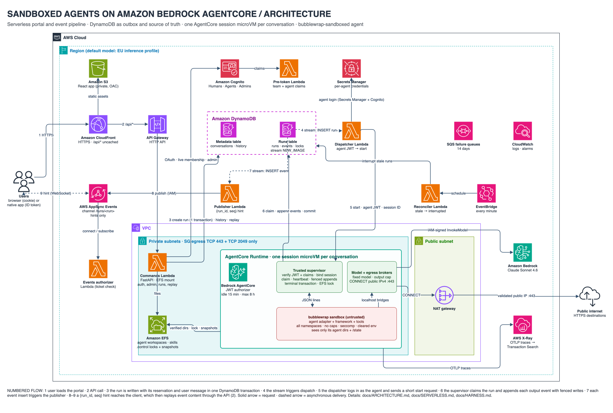
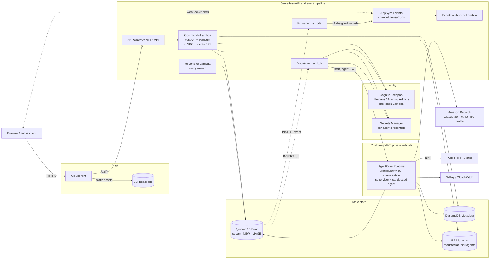
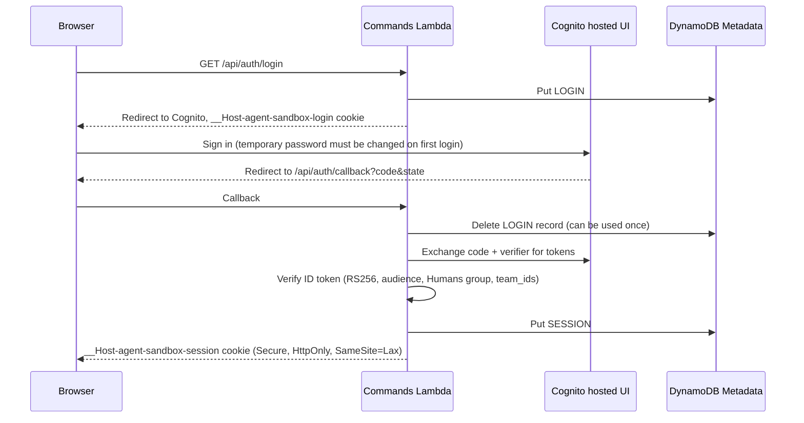
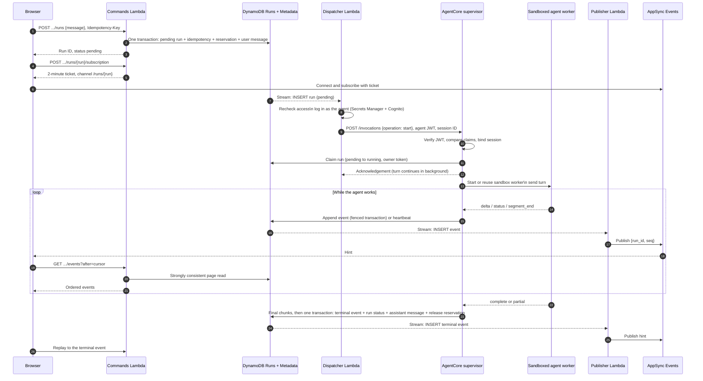
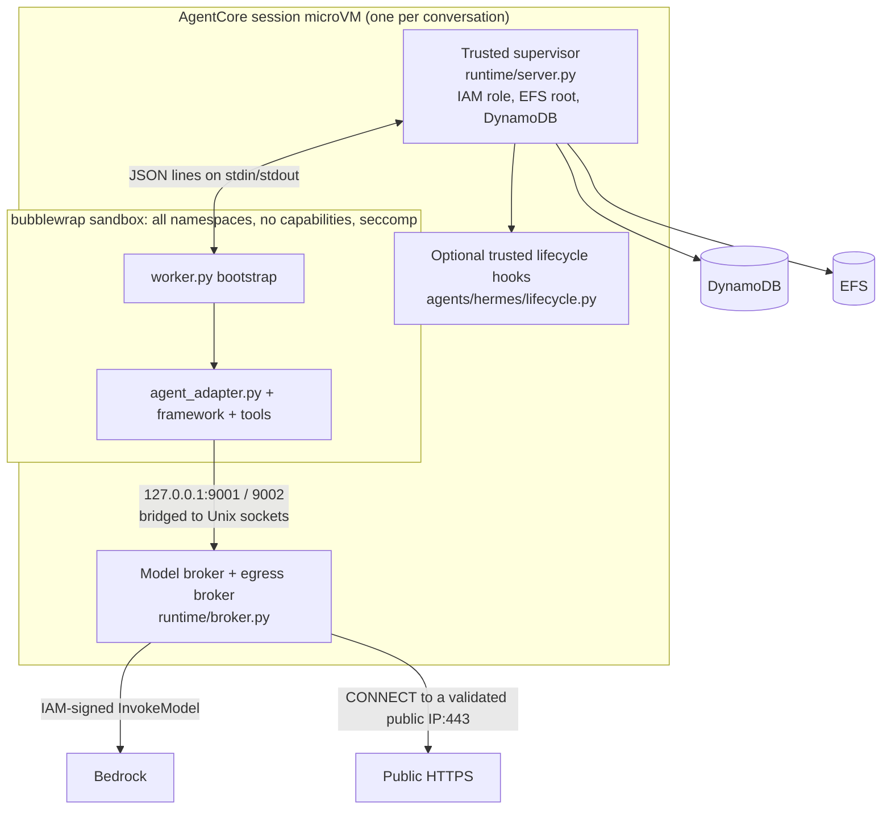

# Solution architecture

This is the starting point for the documentation. It explains what the solution does, which AWS
components it uses, how one chat message moves through the system, and where each piece of state
is stored. The other documents go deeper into individual parts:

| Document                                           | Read it to understand                                                                                                                                  |
| -------------------------------------------------- | ------------------------------------------------------------------------------------------------------------------------------------------------------ |
| [ARCHITECTURE.md](ARCHITECTURE.md) (this file)     | Components, identities, the end-to-end message flow, storage and trust zones                                                                           |
| [SERVERLESS.md](SERVERLESS.md)                     | The serverless run pipeline: DynamoDB records, the stream-driven dispatcher and publisher, retries, recovery and the client API                        |
| [HARNESS.md](HARNESS.md)                           | What happens inside an AgentCore session: the supervisor, the bubblewrap sandbox, the model and egress brokers, and how to add another agent framework |
| [ISOLATION.md](ISOLATION.md)                       | The isolation layers, how they are verified, and the open security findings                                                                            |
| [OBSERVABILITY.md](OBSERVABILITY.md)               | The OpenTelemetry traces the runtime exports, and how to find them in CloudWatch                                                                       |
| [architecture.drawio](architecture.drawio)         | Editable diagrams: an AWS-icon architecture view, the numbered run flow, and the inside of one session (open with diagrams.net)                        |
| [architecture.drawio.png](architecture.drawio.png) | The AWS-icon architecture view as a PNG. The diagram is embedded in the file, so diagrams.net can open and edit the PNG directly.                      |

This is a sample reference implementation, not a formally audited security boundary. Read
[ISOLATION.md](ISOLATION.md#open-findings) before you adapt it.

## What the solution does

The solution is a web portal where people chat with persistent AI agents. Each agent has its own
file workspace, skills and memory files that survive between conversations. The agent runs a real
framework ([Hermes](../agents/hermes/) by default), with tools that can run commands, edit files
and reach public HTTPS websites.

Four design goals shape the architecture:

1. **Agent code is untrusted.** It runs inside a bubblewrap sandbox, inside an Amazon Bedrock
   AgentCore Runtime microVM. It holds no AWS credentials, has no direct network access, and sees
   only its own agent's files.
2. **A turn outlives the request that started it.** A turn can take up to an hour. No Lambda
   function or browser connection holds it open. Its progress is written to DynamoDB, and clients
   can disconnect and replay it later.
3. **Access is controlled by team.** Humans belong to one or more teams. Each agent belongs to
   exactly one team. A conversation is private to the human who created it.
4. **The framework can be replaced.** The platform harness in [`runtime/`](../runtime/) does not
   depend on Hermes. One adapter, chosen when the image is built, plugs a framework into the
   harness.

## Components

The diagram below uses the AWS Architecture Icons. The numbers follow one message through the
system; the full walkthrough is in [End-to-end flow of one message](#end-to-end-flow-of-one-message).

The PNG embeds its diagram, so you can open [`architecture.drawio.png`](architecture.drawio.png)
in diagrams.net and edit it. [`architecture.drawio`](architecture.drawio) contains the same view
plus two more pages: the numbered run flow, and the inside of one session.

The same components, as a text diagram:

Solid arrows are requests. Dashed arrows are asynchronous: DynamoDB stream deliveries and AppSync
notifications. All resources are defined in [`infrastructure/portal-stack.ts`](../infrastructure/portal-stack.ts)
(the `AgentSandboxPortal` stack, deployed with `-c stage=portal`).

| Component                                                                      | Role                                                                                                                                                                                                                                                                                                                                                                 |
| ------------------------------------------------------------------------------ | -------------------------------------------------------------------------------------------------------------------------------------------------------------------------------------------------------------------------------------------------------------------------------------------------------------------------------------------------------------------- |
| **CloudFront + S3**                                                            | Serves the React single-page app from a private bucket through Origin Access Control. Routes `/api/*`, uncached, to the HTTP API.                                                                                                                                                                                                                                    |
| **API Gateway HTTP API**                                                       | Sends `ANY /api` and `ANY /api/{proxy+}` to the Commands Lambda. It has no API Gateway authorizer; the backend performs authentication. CloudFront adds an `X-Origin-Verify` header from a generated Secrets Manager secret, and the Commands Lambda returns 403 when it is missing or wrong, so direct calls to the public `execute-api` URL are refused.                                                                                                                                                                                                                              |
| **Commands Lambda** ([`backend/app.py`](../backend/app.py))                    | The FastAPI backend: login, session cookies, the admin directory, agent provisioning, conversations, run creation, replay, subscription tickets and workspace file downloads. It runs in the VPC so it can mount EFS.                                                                                                                                                |
| **Cognito**                                                                    | One user pool with the `Humans`, `Agents` and `Admins` groups. The human client uses authorization code + PKCE. The agent client uses admin password authentication and issues 15-minute access tokens. A pre-token Lambda ([`infrastructure/lambdas/team-claims`](../infrastructure/lambdas/team-claims/index.py)) signs team and agent-setting claims into tokens. |
| **Secrets Manager**                                                            | Holds one generated username and password for each agent identity. The backend creates the secret when it provisions an agent. The stack defines only the origin-verify secret that CloudFront sends to the API.                                                                                                                                                                                                         |
| **DynamoDB Metadata table**                                                    | Teams, agents, conversations, message history, browser sessions and login state. It has no stream.                                                                                                                                                                                                                                                                   |
| **DynamoDB Runs table**                                                        | Runs, replay events, idempotency records, reservations (locks) and subscription tickets. Its stream is the outbox that drives dispatch and notifications.                                                                                                                                                                                                            |
| **Dispatcher Lambda** ([`backend/events.py`](../backend/events.py) `dispatch`) | Handles each new pending run: rechecks access, logs in as the agent, and sends a short `start` request to AgentCore.                                                                                                                                                                                                                                                 |
| **AgentCore Runtime** ([`runtime/`](../runtime/))                              | One runtime resource. Each conversation gets its own session, which is a separate microVM running the trusted supervisor and a sandboxed agent worker. It uses VPC networking and mounts EFS.                                                                                                                                                                        |
| **Publisher Lambda** (`publish`)                                               | Handles each new event record and publishes a `{run_id, seq}` hint to AppSync.                                                                                                                                                                                                                                                                                       |
| **AppSync Events**                                                             | Delivers hints to connected clients over WebSocket. Publishing requires IAM. Connecting and subscribing use the Events authorizer Lambda (`authorize`) with a short-lived ticket.                                                                                                                                                                                    |
| **Reconciler Lambda** (`reconcile`)                                            | Runs every minute. Marks runs that were never started, or whose producer stopped, as `interrupted`, and releases their reservations.                                                                                                                                                                                                                                 |
| **EFS**                                                                        | Agent workspaces, shared skills and memory files, Hermes conversation snapshots, and per-agent execution locks. One access point (`/agents`, uid/gid 1000) is shared by the backend and the runtime.                                                                                                                                                                 |
| **Amazon Bedrock**                                                             | The model. Only the runtime supervisor calls it, on the agent's behalf.                                                                                                                                                                                                                                                                                              |
| **X-Ray / CloudWatch**                                                         | Runtime traces (see [OBSERVABILITY.md](OBSERVABILITY.md)), Lambda logs, and alarms on Lambda errors, stream lag and failure queues.                                                                                                                                                                                                                                  |

Networking: if you do not pass `vpcId`, the stack creates a two-AZ VPC with one NAT gateway. The
runtime and backend security groups allow outbound TCP 443 to anywhere and TCP 2049 to the EFS
security group, and nothing else. The Dispatcher, Publisher, Reconciler and authorizer Lambdas run
outside the VPC.

## Identities

The solution uses several identities. Most confusion about the design comes from mixing them up.

| Identity                   | What it is                                                                                                                                                                          | Where it is used                                                                                                               |
| -------------------------- | ----------------------------------------------------------------------------------------------------------------------------------------------------------------------------------- | ------------------------------------------------------------------------------------------------------------------------------ |
| **Human**                  | A Cognito user in the `Humans` group. Its ID token carries `team_ids`.                                                                                                              | Logs in to the portal. The backend rereads their Cognito groups and teams on every request.                                    |
| **Admin**                  | A human who is also in `Admins`.                                                                                                                                                    | Manages humans, agents and teams. It does **not** grant access to other people's conversations.                                |
| **Agent record**           | The agent's UUID (`AGENT#<id>` in Metadata), derived from its team and a request UUID.                                                                                              | Portal URLs, reservations, conversation keys.                                                                                  |
| **Agent Cognito identity** | The Cognito user `agent_<id>` in `Agents`. Its `sub` is the execution identity. Its access token carries `team_id`, `execution_mode`, `security_test_mode` and input/output limits. | Authenticates each runtime invocation. Its `sub` selects the EFS directory `/mnt/agents/`.                                |
| **Conversation**           | A UUID with an immutable `owner_sub` (the human who created it).                                                                                                                    | All history, runs, replay and subscriptions are restricted to that owner.                                                      |
| **Runtime session ID**     | A separate UUID stored on the conversation.                                                                                                                                         | Sent as `X-Amzn-Bedrock-AgentCore-Runtime-Session-Id`, so every turn of one conversation reaches the same microVM.             |
| **Run**                    | One submitted message and its execution.                                                                                                                                            | Has a durable status and an ordered list of replay events.                                                                     |
| **Runtime IAM role**       | The AgentCore execution role.                                                                                                                                                       | Used only by the trusted supervisor, for Bedrock, DynamoDB and X-Ray. It is shared by all agents and never enters the sandbox. |

Access rule: a human can use an agent only while the agent's `team_id` is one of the human's
current `team_ids`. Agents belong to exactly one team, so an agent's shared memory and workspace
cannot become a channel between teams.

## End-to-end flow of one message

### 1. Log in

The browser never holds a Cognito token, only the opaque session cookie. Native clients can send a
human Cognito ID token as `Authorization: Bearer` instead (see [SERVERLESS.md](SERVERLESS.md#authentication)).

### 2. Create the agent and a conversation

When a human creates an agent, the backend ([`Services.provision`](../backend/service.py)):

1. writes the agent record, including its fixed execution mode and its limits;
2. creates a Secrets Manager secret holding a generated password;
3. creates the Cognito user `agent_<id>` with team, mode and limit attributes, and adds it to `Agents`;
4. creates `/mnt/agents/<agent-sub>/workspace` on EFS.

Creating a conversation stores `AGENT#<agent> / CONV#<conversation>` in Metadata, with the owner's
`sub` and a new runtime session ID.

### 3. Send a message and run the turn

What each step guarantees:

- **Steps 1–2 (accept).** The Commands Lambda writes the run, its reservation and the user message
  in one DynamoDB transaction. Committing the run insert is also what triggers dispatch, so there
  is no separate "write, then enqueue" step that could half-fail. Resending with the same
  `Idempotency-Key` returns the same run.
- **Steps 7–12 (dispatch).** Only a `pending` run can be claimed. A duplicate or retried dispatch
  for a run that is already claimed returns its status and does not run it again.
- **Steps 13–21 (execute and stream).** The supervisor writes the agent's output to DynamoDB as
  numbered, immutable events. Every write is fenced by the claim owner token. AppSync carries only
  "there is something new" hints. Event **content** always comes from the authorized replay
  endpoint. The browser also polls every five seconds, so a missed hint only adds delay.
- **Steps 22–23 (complete).** The run becomes `complete` only when the terminal transaction
  commits. That transaction also writes the assistant message to conversation history and
  releases the reservation.

The browser can close at any time. The turn keeps running inside AgentCore, and the client
resumes from its last event number. For every retry, recovery and ordering rule, see
[SERVERLESS.md](SERVERLESS.md).

### 4. Inside the AgentCore session

The supervisor is trusted: it holds the IAM role and sees the whole EFS file system. The agent
framework runs in the sandbox and sees only:

- its own agent's workspace at `/workspace/workspace`;
- the agent's shared skills and memory files at `/shared/skills` and `/shared/agent`;
- a private, container-local `/state` for its conversation.

It reaches the model and the internet only through two localhost ports. Behind them, brokers
enforce the fixed model and the output limit, and allow CONNECT only to public IPv4 addresses on
port 443. The worker process stays alive between turns of the same conversation (a "warm" turn).
If it has to be restarted (a "cold" start), Hermes restores its conversation database from a
snapshot on EFS. The details are in [HARNESS.md](HARNESS.md).

### 5. Reload or reconnect

After a reload, the client reads `GET .../runs/active` for the latest run, and pages through
`GET .../messages` for the conversation history. If the latest run is still running, the client
attaches to it and replays from event 0. Run replay records last seven days. Conversation history
does not expire.

## Where state lives

| Store                                                    | Contents                                                                                                                                      | Lifetime                                                                                                                                                | Written by                              |
| -------------------------------------------------------- | --------------------------------------------------------------------------------------------------------------------------------------------- | ------------------------------------------------------------------------------------------------------------------------------------------------------- | --------------------------------------- |
| DynamoDB **Metadata**                                    | Teams, agent records, conversations (owner, runtime session ID, latest run, `adapter_state`), message history, browser sessions, login state  | History and conversations are kept. Sessions expire after 8 h, login state after 10 min. PITR is on, and the table is retained if the stack is deleted. | Backend, runtime (terminal transaction) |
| DynamoDB **Runs**                                        | `RUN#` metadata, `EVENT#` replay events, `IDEMP#` keys, `AGENT#…/LOCK` and `CONVERSATION#…/LOCK` reservations, `TICKET#` subscription tickets | Runs, events and idempotency records expire after 7 days. Tickets expire after 2 minutes.                                                               | Backend, runtime, reconciler            |
| EFS `/mnt/agents/<agent-sub>/workspace`                  | The agent's working files and artifacts. Humans on the team can browse and download them.                                                     | Kept until deleted. EFS is retained if the stack is deleted.                                                                                            | Agent (sandbox), backend (read)         |
| EFS `/mnt/agents/<agent-sub>/<namespace>/{skills,agent}` | Shared skills, and memory files such as `MEMORY.md`, `USER.md` and `SOUL.md`                                                                  | Kept                                                                                                                                                    | Agent (sandbox)                         |
| EFS `/mnt/agents/.control/<agent-sub>/`                  | `execution.lock`, and Hermes snapshots `<conversation>.<run>.db`                                                                              | Kept. Only the supervisor can access it.                                                                                                                | Supervisor, Hermes lifecycle            |
| Container-local `/state`                                 | The live framework database, `HOME`, logs                                                                                                     | Lost whenever the worker or microVM is replaced                                                                                                         | Agent (sandbox)                         |
| Worker process memory                                    | Warm framework objects                                                                                                                        | Until the worker is replaced, AgentCore idles the session out (15 min), or the session reaches its maximum lifetime (8 h)                               | Agent                                   |

## Execution modes

Each agent has a fixed execution mode. It is chosen when the agent is created and signed into its
token.

- **Sequential** (default): at most one active turn across all of the agent's conversations. This
  is enforced twice: by an agent-wide DynamoDB reservation, and by an EFS `flock` on
  `execution.lock` that is held until the result is committed.
- **Concurrent:** different conversations can run at the same time and edit the same shared files.
  A DynamoDB reservation per conversation still orders the turns within one conversation.

## Trust zones

| Zone                                         | Trusted with                                                                             | Code                                                                                      |
| -------------------------------------------- | ---------------------------------------------------------------------------------------- | ----------------------------------------------------------------------------------------- |
| Portal backend Lambdas                       | Cognito admin APIs, all agent secrets, both tables, the whole EFS file system (Commands) | `backend/`                                                                                |
| Runtime supervisor, brokers, lifecycle hooks | The runtime IAM role, the whole EFS file system, both tables                             | `runtime/server.py`, `runtime/broker.py`, `runtime/telemetry.py`, `agents/*/lifecycle.py` |
| Sandbox                                      | Only the three bound directories, a private `/state`, and two broker ports               | `runtime/worker.py`, `agents/*/agent_adapter.py`, framework, tools                        |
| Browser                                      | An opaque session cookie. Replay content is authorized again on every request.           | `frontend/`                                                                               |

Everything outside the sandbox is privileged. In particular, the supervisor and the backend share
broad EFS access. [ISOLATION.md](ISOLATION.md) describes each isolation layer, how it is tested,
and the known gaps.

## Code map

| Path                                                                                 | Contents                                                                                                  |
| ------------------------------------------------------------------------------------ | --------------------------------------------------------------------------------------------------------- |
| [`frontend/`](../frontend/)                                                          | React portal. [`src/runClient.ts`](../frontend/src/runClient.ts) implements submit, subscribe and replay. |
| [`backend/app.py`](../backend/app.py), [`backend/service.py`](../backend/service.py) | HTTP API and domain services (Commands Lambda)                                                            |
| [`backend/lambda_handler.py`](../backend/lambda_handler.py)                          | Commands Lambda entry point; rejects requests without CloudFront's origin-verify header                   |
| [`backend/events.py`](../backend/events.py)                                          | Dispatcher, publisher, AppSync authorizer and reconciler Lambdas                                          |
| [`common/runs.py`](../common/runs.py)                                                | `RunStore`: the DynamoDB transaction protocol shared by the backend and the runtime                       |
| [`common/security.py`](../common/security.py)                                        | JWT verification and no-follow, descriptor-relative directory access                                      |
| [`runtime/`](../runtime/)                                                            | The platform harness: supervisor, sandbox bootstrap, brokers and telemetry                                |
| [`agents/hermes/`](../agents/hermes/), [`agents/echo/`](../agents/echo/)             | Agent adapters. Echo is a minimal adapter with no dependencies.                                           |
| [`infrastructure/`](../infrastructure/)                                              | CDK stacks: `portal-stack.ts` (the solution) and `probe-stack.ts` (an isolation feasibility probe)        |
| [`probe/`](../probe/)                                                                | Probe image used to check sandbox isolation on the managed AgentCore kernel                               |
| [`specs/`](../specs/)                                                                | Product and technical specs, and review decisions                                                         |
