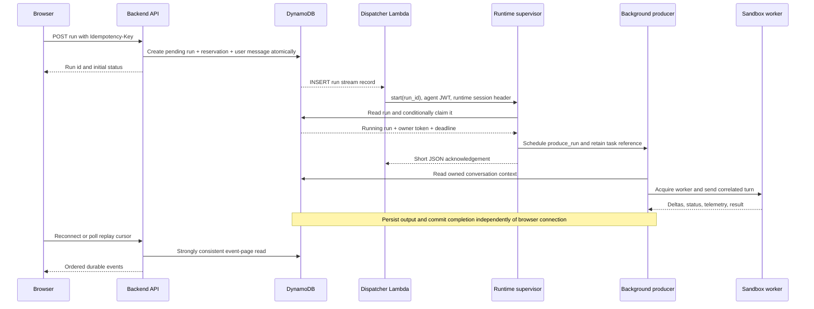
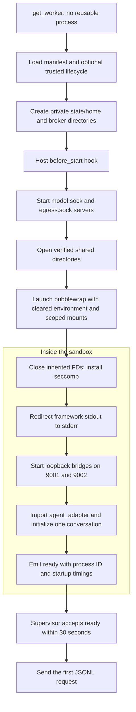
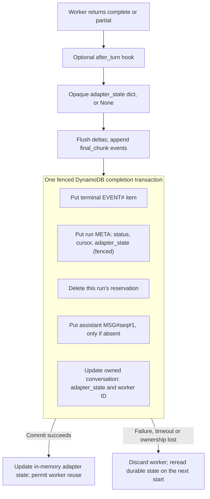
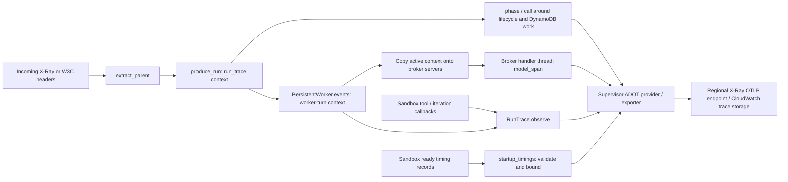
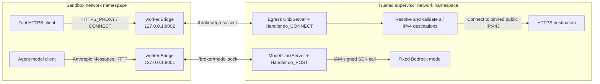

# Platform harness and agent adapters

The [`runtime/`](../runtime/) directory is the **platform harness**. It is installed at
`/app/runtime` in the container. The harness:

- runs an agent framework inside a restricted process;
- is the agent's only route to the model and the internet;
- turns the agent's output into durable application events and diagnostic traces.

The stack deploys one AgentCore Runtime resource. Each conversation uses its own AgentCore
session, which is a separate microVM running the harness and one sandboxed agent. Once a session
has handled a request, it is bound to that agent identity and conversation for its whole life.

This guide follows the code through four stages: admission, execution, durable completion and
observation. After those, it explains how to implement an adapter for another framework. For how
runs reach the runtime in the first place, read [ARCHITECTURE.md](ARCHITECTURE.md) and
[SERVERLESS.md](SERVERLESS.md) first.

- [Responsibility boundary](#responsibility-boundary)
- [Runtime code map](#runtime-code-map)
- [Admission and worker lifecycle](#admission-and-worker-lifecycle)
- [The sandbox](#the-sandbox)
- [DynamoDB coordination and event delivery](#dynamodb-coordination-and-event-delivery)
- [Telemetry and logging](#telemetry-and-logging)
- [Implement an adapter](#implement-an-adapter)
- [Model and egress capabilities](#model-and-egress-capabilities)
- [Runtime configuration](#runtime-configuration)
- [Build and select](#build-and-select)
- [Verification](#verification)

## Responsibility boundary


The browser obtains event **content** through the backend's authorized DynamoDB replay
endpoint. AppSync carries only hints that newer events are available.

The **platform harness** is the additional infrastructure we build around an agent. It is
independent of the framework's own reasoning/execution loop. Hermes is one **sandboxed agent**,
implemented in `agents/hermes/`; it does not create its sandbox, implement the trusted proxies,
write durable run records or publish AppSync notifications.

The code import boundary follows the security boundary. `runtime/server.py` reads a declarative
manifest, never imports `agent_adapter.py`, and mounts only that adapter's directory. Within the
sandbox, the bootstrap closes inherited descriptors and installs seccomp before starting bridges
or importing the adapter. Agent stdout is redirected to stderr so stdout remains a protocol channel.
All frameworks inherit the same namespace, filesystem, credential and egress restrictions.

Known exception: installed Python startup hooks can execute before that bootstrap cleanup; see
[isolation finding 4](ISOLATION.md#finding-4--python-startup-hooks-precede-descriptor-cleanup).

Some agents, such as **Hermes**, keep conversation state in a local database. That state must
survive when a worker or microVM is replaced. Hermes handles this in two places:

- its sandboxed adapter creates SQLite backups;
- its optional, trusted host lifecycle module restores and publishes them.

The harness only provides the lifecycle hooks. It never reads snapshot files, chooses filenames,
restores databases or requires snapshots. That logic belongs to the agent and is opaque to the
harness. Lifecycle code runs outside the sandbox, so any lifecycle module must be reviewed and
trusted like the harness itself.

### Four different kinds of information

| Path                        | Purpose                                          | Contents and lifetime                                                                                               |
| --------------------------- | ------------------------------------------------ | ------------------------------------------------------------------------------------------------------------------- |
| Worker JSONL pipe           | Drive one sandbox process and receive its output | Prompt, correlated deltas/status/results and bounded telemetry callbacks; process-local transport                   |
| DynamoDB application events | Persist run progress, completion and replay      | User-visible text and run state; replay records have seven-day retention, conversation history is stored separately |
| AppSync notifications       | Tell a client to fetch newer events              | `{run_id, seq}` only; notifications can duplicate or be missed                                                      |
| OpenTelemetry spans         | Explain latency, model usage and failures        | Execution IDs, timings, bounded counts and error types; not the chat transcript or source of run truth              |

A worker emitting `complete` is only a proposed outcome. It becomes a durable completed run after
the supervisor's completion transaction succeeds. Likewise, an exported trace or an AppSync hint
does not commit application state.

## Runtime code map

| File                                                                                     | Executes where                                              | Main symbols and responsibility                                                                                                                                   |
| ---------------------------------------------------------------------------------------- | ----------------------------------------------------------- | ----------------------------------------------------------------------------------------------------------------------------------------------------------------- |
| [`server.py`](../runtime/server.py)                                                      | Trusted supervisor, outside bubblewrap                      | `lifespan`, `invoke`, `PersistentWorker`, `execute`, `produce_run`: authentication, admission, subprocesses, lifecycle hooks and durable event production         |
| [`adapter.py`](../runtime/adapter.py)                                                    | Trusted supervisor                                          | `AdapterSpec`, `load_adapter`, `load_lifecycle`, `NoopLifecycle`: validate immutable deployment configuration and load only the optional trusted host integration |
| [`contract.py`](../runtime/contract.py)                                                  | Primarily the sandbox; safe to import in tests/integrations | `AgentConfig`, `TurnResult`, `AgentAdapter`: standard-library-only framework boundary; no AWS, database or snapshot API                                           |
| [`worker.py`](../runtime/worker.py)                                                      | Sandbox process                                             | `secure_process`, `restrict_syscalls`, `Bridge`, `serve`: constrain the process, bridge local sockets, instantiate the adapter and frame correlated events        |
| [`broker.py`](../runtime/broker.py)                                                      | Trusted supervisor process, with server/handler threads     | `start_brokers`, `UnixServer`, `Handler`, `public_target`: enforce model/egress capabilities and perform credentialed Bedrock calls                               |
| [`telemetry.py`](../runtime/telemetry.py)                                                | Trusted supervisor and broker threads                       | `configure`, `run_trace`, `phase`, `call`, `RunTrace`, `model_span`: create bounded spans and export them using host credentials                                  |
| [`Dockerfile`](../runtime/Dockerfile), [`requirements.txt`](../runtime/requirements.txt) | Image build                                                 | Compose the selected agent payload with an independently installed harness environment; start one Uvicorn worker on port 8080                                     |
| [`__init__.py`](../runtime/__init__.py)                                                  | Package marker                                              | Empty; also mounted with `worker.py` and `contract.py` so sandbox imports resolve to the intended package                                                         |

The important supporting modules live outside `runtime/`:

- [`common/runs.py`](../common/runs.py) implements `RunStore`. Both the backend and runtime use
  this same DynamoDB transaction protocol; `server.py` does not embed DynamoDB expressions.
- [`common/security.py`](../common/security.py) verifies Cognito tokens and opens directories
  through descriptor-relative, no-follow operations. [`common/execution.py`](../common/execution.py)
  normalizes sequential/concurrent execution policy.
- [`backend/app.py`](../backend/app.py) authorizes the human, creates runs and serves replay.
  [`backend/events.py`](../backend/events.py) implements dispatch, notification publishing,
  subscription authorization and stale-run reconciliation in separate Lambda functions.
- [`infrastructure/portal-stack.ts`](../infrastructure/portal-stack.ts) supplies IAM permissions,
  VPC/EFS configuration, table names, stream consumers, tracing settings and the selected image.
- [`agents/hermes/lifecycle.py`](../agents/hermes/lifecycle.py) is an optional trusted integration;
  [`agents/hermes/agent_adapter.py`](../agents/hermes/agent_adapter.py) is the sandboxed framework
  integration. These have different trust levels even though they belong to the same implementation.

### How `server.py` is layered

```text
HTTP /invocations
  invoke()                           validate identity, bind session, claim durable run
    create_task(produce_run())        detach execution from the short HTTP acknowledgement
      telemetry.run_trace()          establish the run's diagnostic context
        _produce_run()               coalesce output; heartbeat and write through RunStore
          execute()                  hold shared-file lock; run hooks; finalize or discard
            get_worker()             reuse or replace the session's PersistentWorker
              PersistentWorker.start()
            PersistentWorker.events()
              PersistentWorker._events()   request correlation, pipe reads and deadline
                worker.py: serve()
                  AgentAdapter.run()
```

`_produce_run()` provides a `finalize` callback to `execute()`. This inversion is deliberate:
`execute()` owns the worker and any EFS execution lock, so it must keep both until the producer
has committed the result. Returning from the agent loop alone must not make the worker reusable.

`execute()` yields SSE-formatted strings via `event()`, and `_produce_run()` decodes those strings
back into objects. The durable path uses `operation="start"`; direct HTTP `operation="execute"`
is rejected when `RUN_TABLE_NAME` is configured.

## Admission and worker lifecycle

### Identity and correlation are separate

| Identifier           | Meaning                                                                              |
| -------------------- | ------------------------------------------------------------------------------------ |
| Agent `id`           | Application agent UUID used in metadata and reservation keys                         |
| Agent Cognito `sub`  | Verified execution identity; selects `AGENT_ROOT/<sub>` and binds the supervisor     |
| `conversation_id`    | Logical conversation, with an immutable human owner; also binds the supervisor       |
| `runtime_session_id` | AgentCore session routing ID stored with the conversation and sent by the dispatcher |
| `run_id`             | One submitted message/execution, with a durable status and event cursor              |
| Run `owner`          | Random claim token used to fence DynamoDB writes; not the human conversation owner   |
| Worker `request_id`  | Fresh correlation ID for each JSONL turn; rejects output from another request        |
| `worker_instance_id` | UUID for one sandbox process lifetime; distinguishes warm reuse from replacement     |

The backend checks the human's current team membership and conversation ownership. The dispatcher
obtains an **agent access token**; `invoke()` verifies its issuer, client, token use and `Agents`
group through `Tokens`. Team, execution mode, security-test mode and limits must match signed
claims. It also checks that the stored run matches the agent, conversation, message and mode.

The inbound Cognito token identifies the agent. The supervisor's **IAM execution role** authorizes
outbound DynamoDB, Bedrock and tracing requests. These are different credentials, and neither is
put into the sandbox's cleared environment.

`invoke()` in [`server.py`](../runtime/server.py) admits a `start` request in this order. Each
check that fails returns an HTTP error, and nothing runs:

1. **Verify the token.** The request must have a bearer token that verifies as an agent access
   token: RS256 against the Cognito JWKS, with the expected issuer, client, `token_use` and
   `Agents` group, and a canonical UUID `sub`. Failure returns 401.
2. **Compare the payload with the signed claims.** `team_id`, `security_test_mode`,
   `execution_mode` and the input and output limits must all match. Failure returns 403.
3. **Bind the session.** The first request binds the supervisor process to its agent `sub` and
   `conversation_id`. After that, a request for a different agent or conversation returns 403.
   AgentCore routes by runtime session ID, so this also catches a session ID that was reused by
   mistake.
4. **Check the run.** The run is read with a strongly consistent read. It must belong to this
   agent and conversation, and have the same message and mode (otherwise 403). It must not have
   expired (otherwise 410).
5. **Handle a run that is already claimed.** If the run is no longer `pending`, the supervisor
   returns its current status and does not run it again.
6. **Reserve the supervisor.** If this supervisor is already running a turn (`busy`), it returns
   409 "Agent is busy". The dispatcher treats that as a failure, and the stream retries it.
7. **Claim and start.** The supervisor claims the run in DynamoDB, starts `produce_run()` as a
   background task, and returns `{id, status, last_event_id}`.

### Acceptance is separate from execution



The worker may still be starting after the dispatcher receives its acknowledgement. A duplicate
`start` for a run that is already claimed returns its status rather than executing it again.
Closing a browser or timing out the short dispatch request does not intentionally cancel the
background producer. Process death or supervisor shutdown can still interrupt it; DynamoDB
records and the reconciler handle that outcome.

### Cold start, warm reuse and shutdown

At supervisor startup, `lifespan()` validates the manifest, configures telemetry, creates the JWT
verifier and Bedrock client, initializes `worker_lock`, and runs a minimal bubblewrap namespace
probe. If the probe fails, startup fails rather than falling back to an unrestricted process.

On the first turn, `PersistentWorker.start()` follows this sequence:



The sandbox is described in detail in [The sandbox](#the-sandbox). In short:

- It gets read-only code and libraries, and its own private `/proc`, `/dev` and `/tmp`.
- It sees only the verified shared directories and its private state directory. The agent's EFS
  root and `.control/<sub>` are not mounted.
- The three shared-directory descriptors passed to bubblewrap are closed in the child before any
  agent code is imported.
- `worker.py` blocks the syscalls that manipulate namespaces or privileges. Ordinary framework
  threads and tools still work inside the boundary.

The private state directory (`/state`) is a new temporary directory on the container's local disk
each time a worker starts. It is not on EFS, and everything in it is lost when the worker is
replaced. That is why Hermes needs its snapshot mechanism.

`get_worker()` decides whether a living worker can be reused:

- If the worker belongs to a different agent `sub` or conversation, or the adapter manifest has
  changed, it raises an error. That cannot happen in a correctly bound session.
- If the security mode, input or output limits, or the committed `adapter_state` differ, it
  replaces the worker with a new process.
- Otherwise it reuses the worker (a warm turn).

The supervisor's identity binding survives worker replacement.

On shutdown, the supervisor cancels tracked producers, waits for them, closes the worker and
flushes telemetry. `PersistentWorker.close()` closes stdin to let `serve()` finish and call
`Adapter.close()`; after ten seconds it kills an unresponsive process. Broker servers and private
temporary directories are then cleaned up.

### Three levels of concurrency control

| Control                                 | Scope                                                       | What it prevents                                                                                          |
| --------------------------------------- | ----------------------------------------------------------- | --------------------------------------------------------------------------------------------------------- |
| `busy` and `worker_lock` in `server.py` | One supervisor process                                      | `busy` admits one active turn and drives `/ping`; `worker_lock` serializes acquiring/replacing the worker |
| DynamoDB reservation                    | Agent for sequential mode; conversation for concurrent mode | Admission of conflicting durable runs across processes and requests                                       |
| EFS `execution.lock` via `flock`        | Agent, sequential mode only                                 | Overlapping shared-file execution across runtime sessions, including a stale worker still shutting down   |

Concurrent mode means **different conversation sessions** can run at the same time. It does not
make one sandbox worker execute several turns at once.

The EFS lock is taken without waiting (`LOCK_NB`). If another session holds it, the run fails at
once with "Another session is using this agent". Normally that cannot happen, because the
DynamoDB reservation admits only one run per agent. It can happen if the reconciler released the
reservation of a run whose old worker is still shutting down. The lock is held through the host
hooks and durable finalization, or until the worker has terminated after a failure. A stale
DynamoDB reservation can be reconciled, but the EFS lock is never forcibly taken.

## The sandbox

`PersistentWorker.start()` launches the worker with this bubblewrap configuration
([`server.py`](../runtime/server.py)):

| Aspect      | Configuration                                                                                                                                                                                                                                                                        |
| ----------- | ------------------------------------------------------------------------------------------------------------------------------------------------------------------------------------------------------------------------------------------------------------------------------------ |
| Namespaces  | `--unshare-all`: new user, mount, PID, network, IPC, UTS and cgroup namespaces. The network namespace contains only loopback.                                                                                                                                                        |
| Process     | `--die-with-parent`, `--new-session`, `--cap-drop ALL`, `--clearenv`                                                                                                                                                                                                                 |
| Read-only   | `/usr` (with `/bin`, `/lib`, `/sbin` symlinks), `/opt` (the agent's virtualenv and code), `/etc/ssl`, `/app/runtime/{__init__,worker,contract}.py`, the adapter directory at `/app/adapter`, and the broker socket directory at `/broker`                                            |
| Private     | `--proc /proc`, `--dev /dev`, `--tmpfs /tmp`                                                                                                                                                                                                                                         |
| Read-write  | `/workspace/workspace`, `/shared/skills` and `/shared/agent`, each bound from a verified directory descriptor (`/proc/self/fd/N`), plus the container-local state directory at `/state`                                                                                              |
| Masks       | Each `masked_skill_files` entry from the manifest is covered by a read-only empty file                                                                                                                                                                                               |
| Environment | Only `HOME=/state/home`, `PATH`, `MODEL_ALIAS`, `CONVERSATION_ID`, the admitted limits, `HTTP(S)_PROXY=http://127.0.0.1:9002`, `NO_PROXY`, `ANTHROPIC_BASE_URL=http://127.0.0.1:9001`, the placeholder `ANTHROPIC_API_KEY=sandbox-broker`, and `SECURITY_TEST_MODE=true` if admitted |
| Command     | `/opt/venv/bin/python -I /app/runtime/worker.py`, with working directory `/workspace/workspace`                                                                                                                                                                                      |

These are never mounted: the EFS root `/mnt/agents`, the `.control` directory, the harness's own
virtualenv `/harness-venv`, and the supervisor modules (`server.py`, `broker.py`, `telemetry.py`,
`common/`).

The shared directories are opened with descriptor-relative, `O_NOFOLLOW` operations
([`common/security.py`](../common/security.py)). A symlink planted by the agent therefore cannot
redirect a mount. `AGENT_ROOT/<sub>/workspace` must already exist; the backend creates it when it
provisions the agent. `.control/<sub>`, `<namespace>/skills` and `<namespace>/agent` are created
with mode 0700 if they are missing.

Inside the sandbox, `secure_process()` in [`worker.py`](../runtime/worker.py) runs first. It
closes every inherited descriptor above stderr, then installs a seccomp filter that allows
everything by default except:

- `mount`, `umount2`, `pivot_root`, `unshare`, `setns`, `ptrace`, `open_by_handle_at`, `bpf`,
  `perf_event_open`, `userfaultfd`, `keyctl`, `reboot`, `kexec_load`, `init_module` and
  `finit_module`, which return `EPERM`;
- `clone3`, which returns `ENOSYS`, so the C library falls back to `clone`;
- `clone` with any `CLONE_NEW*` namespace flag, which returns `EPERM`.

At supervisor startup, `lifespan()` runs a minimal bubblewrap probe (`--unshare-all --cap-drop ALL
... /usr/bin/true`). If namespaces are unavailable, the supervisor refuses to start rather than
run agents without isolation. [ISOLATION.md](ISOLATION.md) describes how these controls are
verified, and their known gaps.

## DynamoDB coordination and event delivery

### The two tables

`run_store()` constructs a cached `RunStore` using `RUN_TABLE_NAME` and `TABLE_NAME` and the
supervisor's IAM credentials. Synchronous SDK calls from the producer are normally wrapped in
`telemetry.call()`, which adds a phase span and runs the call with `asyncio.to_thread()`.
Admission uses `asyncio.to_thread()` directly for run reads and claims.

The following are the records relevant to execution; the application metadata table also holds
other portal records.

| Table          | Partition key / sort key                                   | Responsibility                                                                                                         |
| -------------- | ---------------------------------------------------------- | ---------------------------------------------------------------------------------------------------------------------- |
| Run table      | `RUN#<run> / META`                                         | Run identity, message, status, claim owner, `last_event_id`, heartbeat time, deadline and optional completion metadata |
| Run table      | `RUN#<run> / EVENT#<20-digit-seq>`                         | Immutable JSON replay event; its insertion drives notifications                                                        |
| Run table      | `IDEMP#<derived-key> / META`                               | Maps human + agent + conversation + idempotency key to one run and message hash                                        |
| Run table      | `AGENT#<agent> / LOCK`                                     | Sequential-mode reservation containing the active run ID                                                               |
| Run table      | `CONVERSATION#<agent>#<conversation> / LOCK`               | Concurrent-mode reservation for that conversation                                                                      |
| Run table      | `TICKET#<token-hash> / META`                               | Short-lived, run-scoped AppSync subscription authorization; managed by the backend                                     |
| Metadata table | `AGENT#<agent> / CONV#<conversation>`                      | Human owner, runtime-session mapping, latest run and optional committed `adapter_state`                                |
| Metadata table | `MESSAGES#<agent>#<conversation> / MSG#<sequence>#0 or #1` | User message (`#0`) and materialized assistant message (`#1`)                                                          |
| Metadata table | `CLIENT#<human> / SESSION#<conversation>`                  | Client-to-conversation mapping and latest run                                                                          |

`RunStore.create()` atomically inserts the pending run, idempotency record and reservation, updates
the conversation's latest run, and writes the user message/client mapping. Reusing a valid key
with the same message returns the original run; changing the message for that key is a conflict.
The stream record comes from this committed insert, avoiding a separate database-plus-dispatch
dual write in the API.

### Claim, heartbeat and fencing

`claim()` changes a `pending` run to `running` only if the run has not expired. It sets a random
owner token and records a deadline 3,720 seconds after the claim. A run that has already been
claimed is never run again automatically.

The two time limits are enforced in different places:

- **The one-hour execution budget** (3,600 seconds) is enforced by the supervisor's pipe reader,
  `PersistentWorker._events()`, for each turn. It starts when the request is written to the
  worker. It does not include worker startup, host hooks or finalization.
- **The 3,720-second claim deadline** is enforced only by the `heartbeat()` condition. A heartbeat
  after the deadline raises `LostOwnership`, which stops the producer.

While it processes events, the producer checks whether a heartbeat is due. About every 15
seconds, it calls `heartbeat()` to update `updated_at`. That update succeeds only while the run is
still `running`, is owned by the same token, and has not passed its deadline. If the worker's pipe
has been quiet for 15 seconds, the pipe reader emits an internal heartbeat event, so a heartbeat
still happens during long, silent model calls. This is not a separate watchdog thread, and
heartbeats do not extend the deadline.

A heartbeat can happen only when control returns to the producer. Worker startup, host hooks or
stalled storage calls can delay it. A continuous stream of telemetry-only records can also
postpone it: those records reset the pipe-read timeout, but they are consumed before the producer
checks whether a heartbeat is due. None of these paths has an independent heartbeat, so the
reconciler can still judge such work stale after three minutes.

Every `append()` transaction compares the expected **status, event cursor and update timestamp**,
plus the **claim owner** when the run has been claimed. This is the write fence: a reconciler or
another accepted transition invalidates
the stale producer's expected state. `LostOwnership` stops that producer from overwriting the winner.

### Output shaping and atomic completion

`_produce_run()` collects delta text before writing it. It writes the buffer when:

- the buffer reaches 2,048 characters;
- a new delta arrives at least 250 ms after the previous write;
- any non-delta event arrives. This includes the internal heartbeat, so buffered text is written
  within about 15 seconds even if the agent sends nothing else.

There is no separate 250 ms timer. `segment_end` keeps the last interim segment and starts a new
one. The final text is taken from the explicit result if there is one, otherwise from the current
segment, otherwise from the last interim segment.

| Incoming event                                                          | Supervisor handling                                                                                          | Persisted?                                     |
| ----------------------------------------------------------------------- | ------------------------------------------------------------------------------------------------------------ | ---------------------------------------------- |
| `ready`                                                                 | Consumed while acquiring the worker                                                                          | No                                             |
| Supervisor `status` ("Starting…" or "Reusing persistent agent process") | Emitted by `execute()` after the worker is acquired                                                          | Yes                                            |
| `delta`                                                                 | Coalesced as described above                                                                                 | Yes, as ordered `delta` events                 |
| `segment_end`, `status`                                                 | Pending deltas are written first, then the event                                                             | Yes                                            |
| Internal `heartbeat`                                                    | Pending deltas are written, and a run heartbeat may be sent                                                  | No                                             |
| `telemetry`                                                             | Consumed by `telemetry.observe()`                                                                            | No                                             |
| `complete`, `partial`                                                   | The host `after_turn` hook runs, final chunks are written, then the terminal outcome is committed atomically | Yes: `final_chunk` events and a terminal event |
| `error`                                                                 | The worker is discarded and a `failed` terminal event is persisted                                           | Yes                                            |
| Worker exits with no terminal event                                     | "Execution ended without a terminal response."                                                               | Yes, `interrupted`                             |

The final text is replayed as `final_chunk` events even though clients already received it as
deltas. That lets a client that missed some deltas render the correct final answer. The terminal
event itself has empty `text`. It carries the status, `reason`, and worker identifiers.

**Error mapping.** How the run ends depends on the kind of failure:

- An `OSError`, `ValueError`, `RuntimeError` or `TimeoutError` inside `execute()` (for example a
  worker crash, a correlation mismatch, the deadline, or an oversized line) becomes the generic
  error "Execution failed or timed out." and a `failed` run. A busy EFS lock also produces a
  `failed` run, with its own message.
- Any other exception in the producer, such as a DynamoDB `ClientError` during finalization or a
  bug in a lifecycle hook, is recorded as `interrupted`.
- `LostOwnership` writes nothing at all. Another writer has already taken over the run, and the
  reconciler records its outcome.

On the durable `start` path, **every** error discards the worker, including the non-fatal
input-limit rejection. For Hermes, the next turn therefore restores from the last committed
snapshot.

An ordinary append is two writes in one DynamoDB transaction: it inserts the next event and
updates the run's cursor. Every terminal append also deletes the run's reservation. A
`complete` or `partial` outcome additionally writes the assistant history message and updates the
conversation:



Final chunks are ordinary preceding event transactions, each containing up to 8,192 characters.
Seeing a chunk does not imply a committed terminal outcome. The final message is bounded to
300,000 UTF-8 bytes; each persisted event to 200,000 bytes. The worker pipe has its own 256 KiB
line limit, applied before the producer can split a final result.

Completion requires final text but **does not require adapter state**. The generic store accepts
`None` or a dictionary whose JSON encoding is at most 4 KiB; it does not interpret that dictionary
as a path or snapshot. Only complete/partial outcomes can commit it. Hermes' lifecycle supplies
its snapshot pointer; Echo supplies `None`. The snapshot bytes never pass through DynamoDB.

`RunStore.append()` retries the same conditional transaction up to three times after the initial
attempt only when cancellation reasons contain `TransactionConflict` and no other failure code,
using exponential jitter and strongly consistent fencing checks. Run creation has separate
idempotency/reservation recovery; claim and heartbeat use conditional single-item updates.
The append code can recognize
an already-written matching event when handling a transaction cancellation. It does not implement
general recovery from an exhausted transport timeout or an ambiguous claim response; the
conservative path is interruption/reconciliation, not automatic tool re-execution.

### How events reach the browser

This section summarizes the delivery path from the harness's point of view. The complete client
protocol, the retry settings and the recovery rules are in [SERVERLESS.md](SERVERLESS.md).

The run table is also a **transactional outbox**. Two separate stream consumers inspect INSERT
records in [`backend/events.py`](../backend/events.py):

1. `dispatch()` selects `kind="run"`, rechecks access, obtains the agent token and invokes the
   runtime's short `start` operation.
2. `publish()` selects `kind="event"`, groups records by run and publishes the highest observed
   sequence as an AppSync hint. It signs the request with the publisher Lambda's IAM role.

Both consumers report per-record failures so delivery can retry. The harness persists events;
it does **not** directly publish to AppSync. A notification failure cannot roll back an already
persisted event. Clients react to hints and periodically fetch replay; `RunStore.page()` reads
up to 100 events with a strongly consistent query and checks that sequences are contiguous.
Authorization is checked by the API for each replay request. Subscription tickets are separately
checked for identity, current access, expiry and the exact run channel.

Run/event/idempotency records expire after seven days; TTL cleanup is asynchronous. Conversation
history and committed adapter metadata are retained separately. A replay gap or expired run is
reported explicitly so the client can reload history instead of silently skipping output.

### Interruption and recovery

The scheduled reconciler queries the `WorkByStatus` index for pending runs idle for five minutes
or running runs idle for three minutes, then strongly rereads each candidate before attempting
a conditional `interrupted` transition. It releases only the matching durable reservation. It
does not resume a claimed run or remove an EFS execution lock.

| Situation                                                                                      | Result                                                                                         |
| ---------------------------------------------------------------------------------------------- | ---------------------------------------------------------------------------------------------- |
| Browser disconnects                                                                            | The accepted background work continues. The client reconnects using its durable cursor.        |
| Worker exceeds its read deadline, sends a line over 256 KiB, or sends the wrong correlation ID | The run is `failed` and the process is discarded                                               |
| Worker exits without a terminal event                                                          | The run is `interrupted` and the process is discarded                                          |
| Host lifecycle hook fails                                                                      | No successful completion is committed, and the worker is cleaned up                            |
| Completion fails or its response is ambiguous                                                  | The worker is discarded, to be safe. A result that may have been committed is never run again. |
| Supervisor disappears                                                                          | Committed events survive. The reconciler eventually records the interruption.                  |
| AppSync publication fails                                                                      | Consumer retries and client polling recover notification delivery                              |
| Trace flush fails                                                                              | A warning is logged. Committed application work is not affected.                               |

The transaction fence provides ordered durable application state, not a transaction over arbitrary
tool actions. Shared-file writes and external side effects may already have happened when a turn
fails. Framework-specific recovery, such as Hermes snapshots, is described separately below.

## Telemetry and logging

[`telemetry.py`](../runtime/telemetry.py) observes the execution paths above; it does not coordinate
runs. DynamoDB remains the authority for status and replay. Tracing code runs in the trusted
supervisor, while the sandbox emits only small callback/timing records over its existing pipe.

### Trace context crosses tasks and threads explicitly



`extract_parent()` prefers a valid `X-Amzn-Trace-Id`, falling back to W3C `traceparent`/`tracestate`.
Arbitrary incoming baggage is not propagated. The extracted context is passed into the background
task; `run_trace()` creates `invoke_agent <adapter-id>`, attaches a `RunTrace` observer and sets
local `session.id` baggage for correlation.

`telemetry.call()` preserves context across `asyncio.to_thread()` calls. Broker handler threads
need an explicit handoff: `PersistentWorker.events()` captures the current worker-turn context on
each broker server, and `model_span()` reads it in the handler. Cleanup clears only that turn's
context. The worker never supplies an OTel parent or exporter configuration.

### Span structure and measurements

A typical successful cold turn looks like this. Reused workers skip the startup subtree.
Persistence spans can appear throughout a turn, not only at the end.

```text
invoke_agent hermes-v1
  agentcore.session.lookup
  agentcore.workspace.prepare
  agentcore.worker.acquire                 attribute: agentcore.worker.reused
    agentcore.worker.local_state
    agentcore.lifecycle.before_start
    agentcore.brokers.start
    agentcore.mounts.prepare
    agentcore.worker.bootstrap
      agentcore.process.launch
      agentcore.worker.security            worker-reported interval
      agentcore.worker.bridges             worker-reported interval
      agentcore.adapter.imports            worker-reported interval
      agentcore.adapter.initialize         worker-reported interval
  agentcore.event.persist                  supervisor "Starting persistent agent process" status
  agentcore.worker.turn
    chat <model alias>                     one span per broker inference request
    execute_tool <allowlisted name>        paired lifecycle callback observations
    agentcore.event.persist                deltas / status / segment_end while the turn runs
    agentcore.heartbeat                    about every 15 s
  agentcore.lifecycle.after_turn
  agentcore.run.finalize
    agentcore.event.persist                final chunks / remaining text
    agentcore.completion.commit
  agentcore.worker.discard                 only when the worker is thrown away
```

- **Run span:** carries agent, conversation, runtime-session and run IDs; records final status,
  broker model-call count, maximum observed iteration number and summed input/output usage.
  Partial outcomes are marked non-success even though their output is durably saved.
- **Model span:** encloses the actual broker call and response consumption, including streaming.
  It records the configured model, requested output limit and provider-reported usage. Cache read
  and creation counts are separate attributes. Broker request count can differ from a framework's
  logical iteration count.
- **Tool span:** pairs `tool_start` and `tool_end` by a bounded call ID. Tool names use an allowlist,
  with unknown names mapped to `other`; at most 128 tool spans remain open. An end callback means
  a result became available, not that the tool succeeded. Unclosed spans are marked `unresolved`.
- **Startup spans:** `StartupTimings` measures wall-clock intervals in the worker and includes
  them in `ready`. The supervisor accepts only known, nonduplicate, ordered intervals inside
  its observed bootstrap window. It reconstructs child spans from those timestamps rather than
  estimating them from message arrival time.
- **Phase errors:** record the exception type and error status without adding exception messages
  or automatic exception events to the span. Finish reasons must also match a bounded format.

Span durations overlap: tool/model work and event persistence can share a parent, and concurrent
operations are not additive. The worker-turn span ends before the host `after_turn` hook and final
commit, allowing agent execution time to be distinguished from completion overhead.

### Export, privacy and operational logs

`configure()` explicitly initializes ADOT when `AGENT_OBSERVABILITY_ENABLED=true`, with automatic
library patching disabled. The deployed configuration uses `OTEL_SERVICE_NAME=agent-harness`,
an OTLP/HTTP exporter to `https://xray.<region>.amazonaws.com/v1/traces`, and unified CloudWatch
trace delivery. Application traces are sampled at 100% by the stack configuration.

Application spans intentionally leave out prompts, responses, tool arguments and results, memory,
and authorization headers. `execute()` intercepts worker telemetry, so it never becomes a chat
replay event. `run_trace()` writes structured `agent.turn.started` and `agent.turn.finished` log
records that contain the run ID and trace ID. Use them to go from operational logs to traces.
These records are written only when observability is enabled.

Ordinary process logs are a separate channel from sanitized spans. Framework stdout is redirected
to worker stderr; the supervisor normally discards that stderr. `WORKER_DEBUG=1` forwards it for
diagnosis and can expose framework-produced content. Supervisor errors still use normal logging.
OTel metric/log exporters are disabled in the stack; native AgentCore metrics and process logging
continue independently. `flush()` runs after a background run and during shutdown, with a bounded
three-second wait and warning-only handling for flush failures.

For CloudWatch queries and deployment prerequisites, see
[`OBSERVABILITY.md`](OBSERVABILITY.md). For durable-delivery and authorization details, see
[`SERVERLESS.md`](SERVERLESS.md).

## Implement an adapter

Add a directory such as `agents/myagent/` with three files:

1. **`install.sh`** installs the agent's Python environment at `/opt/venv` and any immutable code
   under `/opt`. It runs during image build, not with runtime credentials. Pin framework versions
   here. The harness has its own dependencies in `/harness-venv`, outside the sandbox mounts.
2. **`manifest.json`** describes the deployment contract (example below).
3. **`agent_adapter.py`** exports an `Adapter` class implementing `runtime.contract.AgentAdapter`.

```json
{
  "id": "myagent-v1",
  "protocol_version": 1,
  "model_protocol": "anthropic_messages",
  "storage_namespace": "myagent",
  "masked_skill_files": [],
  "host_lifecycle": false
}
```

The manifest is trusted build/deployment configuration. Requests cannot select a module, command,
mount or environment map. The loader rejects unsupported protocol versions/model protocols and
invalid storage names/masks. Changing a live worker's manifest fails closed. An adapter ID defines
its contract; use a distinct ID for a distinct contract.

### Python interface

| Method                         | Contract                                                                                                                                                                |
| ------------------------------ | ----------------------------------------------------------------------------------------------------------------------------------------------------------------------- |
| `Adapter(config, emit)`        | Initialize one private conversation. Persistence, if any, is implementation-specific.                                                                                   |
| `estimate_tokens(text) -> int` | Estimate the number of tokens, for positive token-based input limits. MB limits are enforced by the bootstrap on UTF-8 bytes, where 1 MB means 1 MiB (1,048,576 bytes). |
| `run(message) -> TurnResult`   | Execute a turn, optionally emit interim events, and return text plus completed/partial status. Raise on failed turns.                                                   |
| `close()`                      | Release framework resources. Called when input closes or execution fails. Clean up partially initialized resources if the constructor fails.                            |

`AgentConfig` supplies conversation ID, model alias, output cap, execution budget, model URL/key,
private state and shared paths. Zero output cap means no application cap; the adapter must map it
to its framework's equivalent. The trusted broker independently enforces a positive output cap.
The supervisor enforces the one-hour execution deadline, including frameworks without native budgets.

The event callback accepts:

- `emit('delta', text=...)`: incremental interim output.
- `emit('segment_end')`: finish a pre-tool/interim segment.
- `emit('status', text=...)`: progress information.
- `emit('telemetry', event='model_iteration', iteration=...)` or paired
  `tool_start`/`tool_end` events with `tool_call_id` and `tool_name`.

Use the bounded telemetry schema in `runtime/telemetry.py`; unknown tool names become `other`.
Prompts, tool arguments/results, credentials and exporter configuration do not belong in telemetry.
Tool durations measure callback observation, not necessarily framework execution time.

The bootstrap assigns request IDs, emits `ready` once, and owns the terminal `complete`,
`partial` and `error` events. When `run` returns, it emits `complete` if `TurnResult.completed` is
true, and otherwise `partial` with the result's `reason`. If `run` raises, it emits `error`.
Adapters cannot emit terminal events through the callback, and cannot override correlation IDs.
All callback threads must finish before `run` returns; do not leave callbacks running into the
next request.

### Worker wire protocol

The parent sends one JSON object per line. It contains `request_id`, `conversation_id` and
`message`, plus the admitted invocation fields. The worker replies with JSON lines:

- `ready` has a null request ID;
- turn events carry the current request ID;
- each turn ends in `complete`, `partial` or `error`.

The supervisor checks the correlation. It terminates and discards the worker when a durable
execution fails.

One exception: if the bootstrap itself crashes, for example on a malformed request line or a
conversation mismatch, its last error has a null request ID. The supervisor reports that as a
correlation failure.

Limits:

- The parent reads at most 256 KiB per line, so split streamed text into smaller pieces.
- Durable final text is separately capped at 300,000 UTF-8 bytes.
- Error messages are truncated to 500 characters.

### Optional trusted host lifecycle

Most agents need only the three files above. The default `host_lifecycle: false` uses no-op hooks.
Echo uses this default: it has no snapshot API, writes no state files and completes durable runs
normally. Its in-process counter survives worker reuse and resets after worker replacement.

An implementation may set `host_lifecycle: true` and supply a **trusted** `lifecycle.py` exporting
`Lifecycle`. This module runs outside the sandbox in the harness environment. It must be reviewed
as trusted integration code and must not import or execute the framework, tools or user code.
It is distinct from the sandboxed `agent_adapter.py`; enabling it is immutable image configuration,
never an invocation option.

| Hook                                                        | Contract                                                                                                                                                                                    |
| ----------------------------------------------------------- | ------------------------------------------------------------------------------------------------------------------------------------------------------------------------------------------- |
| `before_start(state, control_fd, conversation_id, context)` | Prepare private local state before worker launch. Receives a verified per-agent control directory descriptor and owned conversation metadata. Do not retain the descriptor beyond the call. |
| `after_turn(state, control_fd, run_id)`                     | Called after complete/partial worker output, before durable completion and worker reuse. Return optional `dict` completion metadata (at most 4 KiB), or `None`.                             |

The generic run store commits the optional value as `adapter_state` on both the run and the
conversation. It does so in the same transaction as the final message, the status and the release
of the reservation. It does not interpret the value, and missing state is valid. If a hook fails or
finalization fails, the worker is discarded before any sequential lock is released. Completion
metadata is not included in public event replay. This coordinates commits without forcing any
persistence mechanism on other frameworks.

Hooks are synchronous and run on the supervisor's event-loop thread. A slow hook, such as
Hermes reading and fsyncing a large snapshot, delays `/ping` responses and other requests until it
returns. The lifecycle module is loaded again each time a worker starts.

### Hermes snapshots

All snapshot logic lives under `agents/hermes/`:

1. **Restore.** `lifecycle.py:before_start` restores the snapshot that the conversation's committed
   `adapter_state` points to, copying it to the local `/state/state.db`. Older conversations that
   have no `adapter_state` use their legacy `checkpoint_name` pointer. If there is no pointer at
   all (for example, a new conversation), it tries the mutable `<conversation>.db`. If that is
   missing too, Hermes starts with an empty database.
2. **Back up.** After a successful or partial execution, `agent_adapter.py:run` calls its own
   `save_snapshot()`. This writes a consistent SQLite backup to `/state/checkpoint.db` before the
   result is returned.
3. **Publish.** `lifecycle.py:after_turn` reads at most 64 MiB of that backup, publishes it to EFS
   as an immutable, fsynced file for this run, and returns
   `{"adapter": "hermes-v1", "checkpoint": "<conversation>.<run>.db"}`.
4. **Commit.** The normal completion transaction commits that opaque metadata. Only after that is
   the worker reused.

Recovery rules:

- A committed pointer whose file is missing fails closed, and so does a pointer to another
  conversation's file.
- If a commit is rejected, the previously committed snapshot stays authoritative.
- If the commit succeeds but its response is lost, the committed pointer is authoritative.
- The host lifecycle treats snapshot bytes as opaque and never opens the untrusted SQLite data.
  Database operations happen only inside the Hermes sandbox.

When a worker starts, Hermes restores only its SQLite snapshot; its other private files are
temporary. The shared workspace, skills and agent files are separate, and a failed turn does not
roll them back. Snapshot filenames, encoding, limits, publication and recovery rules are Hermes
implementation details, not part of `runtime.contract`.

Shared paths are fixed capabilities:

- `/workspace/workspace` → the verified agent's workspace.
- `/shared/skills` → `<storage_namespace>/skills`.
- `/shared/agent` → `<storage_namespace>/agent`.
- `/state` and `/state/home` → private local storage for this conversation.

Hermes uses the `hermes` namespace, so its files live under `/mnt/agents/<sub>/hermes/`. Its
adapter:

- stores `MEMORY.md`, `USER.md` and `SOUL.md` in the agent-wide shared storage;
- rereads those prompt files before each turn;
- turns off trajectories;
- masks the shared skill ledgers `.curator_ledger.jsonl` and `.usage.json`.

All of that policy lives in `agents/hermes/`, not in the harness.

## Model and egress capabilities

The agent has ordinary localhost HTTP endpoints, but these are bridges into narrowly scoped
host services. `worker.Bridge` relays bytes between sandbox TCP connections and Unix-domain sockets
created by `broker.start_brokers()`. Network namespaces block direct external connectivity; the
read-only `/broker` directory mount exposes the two socket endpoints without exposing host credentials.



### Model broker

`Handler.do_POST()` accepts only `/v1/messages` on the model socket. It checks that:

- `Content-Length` is positive and at most 2 MiB, and the body is not transfer-encoded;
- the request names the configured `MODEL_ALIAS`;
- only allowlisted inference parameters are present;
- `max_tokens` is a positive integer, and no greater than the agent's output cap when the cap is
  positive. A request that omits `max_tokens` is checked as 4,096.

The broker removes the client-facing alias/stream flag, sets the Bedrock Anthropic API version,
and calls the fixed `BEDROCK_MODEL_ID` through the supervisor's boto3 client. That client is
created once at supervisor startup with adaptive retries (at most two attempts), a ten-second
connect timeout and a 120-second read timeout. The sandbox's `sandbox-broker` API key is a
placeholder for SDK compatibility, not an AWS credential.

Non-streaming requests use `invoke_model()` and return JSON. Streaming requests use
`invoke_model_with_response_stream()` and translate Bedrock chunks into Anthropic SSE events.
`telemetry.model_span()` surrounds the broker operation, and `record_usage()` extracts bounded
provider usage fields as responses pass through. This model-response SSE stream is distinct
from worker JSONL, durable event replay and AppSync notifications.

### Egress broker

`Handler.do_CONNECT()` is enabled only on the egress socket. `public_target()` rejects malformed
authorities and ports other than 443, resolves the hostname outside the sandbox, and rejects
the request if **any** returned IPv4 address is not globally routable. It then connects directly
to one validated IP, rather than resolving the hostname again. This blocks private, link-local
and metadata destinations and avoids a second DNS lookup between validation and connection.

The relay passes the client's TLS stream through unchanged. It does not decrypt content, and it
has no HTTP path allowlist. A redirect that needs a new CONNECT goes through the same destination
checks. A CONNECT that is rejected, or whose upstream connection fails, is closed without an HTTP
error response.

Timeouts:

- A relay lives for at most 240 seconds.
- Broker sockets time out after 60 seconds, and upstream connects after 10 seconds.
- A sandbox bridge closes a connection after 120 seconds with no data in either direction. A
  non-streaming model call longer than that is cut off, so frameworks should stream.

Plain `http://` URLs do not work through `HTTP_PROXY`: the egress broker implements only CONNECT.

The model capability is **Anthropic Messages**, and egress is **public HTTPS CONNECT**. Sandbox
integrations use these interfaces, including the proxy environment. Framework independence does
not itself provide an OpenAI endpoint, direct AWS SDK access inside the sandbox or arbitrary networking.

## Runtime configuration

Deployment settings are consumed by the supervisor; only an explicit allowlist is copied into
the sandbox. Invocation-scoped settings are separately validated against signed agent claims.

| Setting                                                                                   | Consumer and effect                                                                                             |
| ----------------------------------------------------------------------------------------- | --------------------------------------------------------------------------------------------------------------- |
| `AGENT_ADAPTER_MANIFEST`                                                                  | `adapter.load_adapter()`; immutable image path selecting the adapter and optional trusted host lifecycle        |
| `COGNITO_ISSUER`, `AGENT_CLIENT_ID`                                                       | `lifespan()` / `Tokens`; inbound agent-token verification                                                       |
| `AGENT_ROOT`                                                                              | `server.py`; trusted EFS root, default `/mnt/agents`                                                            |
| `RUN_TABLE_NAME`, `TABLE_NAME`                                                            | `common.runs.run_store()`; run and metadata tables; configuring the run table requires the durable `start` path |
| `AWS_REGION`, `BEDROCK_MODEL_ID`, `MODEL_ALIAS`                                           | Host Bedrock client and broker; only the client-facing alias is copied into the sandbox                         |
| `AGENT_OBSERVABILITY_ENABLED`                                                             | `telemetry.configure()`; opt into explicit ADOT initialization                                                  |
| `OTEL_SERVICE_NAME`, `OTEL_EXPORTER_OTLP_TRACES_ENDPOINT` and related OTel settings       | Supervisor exporter; the stack configures the `agent-harness` service and regional trace destination            |
| `WORKER_DEBUG`                                                                            | Supervisor subprocess configuration; `1` forwards worker stderr instead of discarding it                        |
| Signed `security_test_mode`, `input_limit_value`, `input_limit_unit`, `max_output_tokens` | `invoke()` compares claims and payload; accepted values become the worker's narrow execution configuration      |
| Signed `execution_mode`                                                                   | Admission, reservation selection and EFS lock policy; frozen on the run                                         |

`HOME`, `PATH`, `CONVERSATION_ID`, the admitted limits and model/proxy compatibility variables are
set explicitly for bubblewrap. `SECURITY_TEST_MODE=true` is added only when admitted; false omits
it. Table names, JWTs, AWS credentials and OTel exporter settings are not part of that environment.
`HERMES_HOME` and terminal/skill configuration are created by the Hermes adapter after sandboxing.

The Dockerfile starts `uvicorn runtime.server:app` with a single worker. `/ping` returns
`HealthyBusy` while a turn is reserved and `Healthy` otherwise. That health signal is local to
the runtime session; the durable run status comes from DynamoDB. The stack configures an
AgentCore idle session timeout of 900 seconds and maximum lifetime of 28,800 seconds. A runtime
session uses the image version with which it was created.

## Build and select

```sh
# Default pinned Hermes adapter
docker build -f runtime/Dockerfile -t agentcore-hermes .

# Same harness, no Hermes code or dependencies
docker build -f runtime/Dockerfile --build-arg AGENT_SOURCE=agents/echo -t agentcore-echo .

# CDK image selection (add the deployment's existing VPC/subnet context as usual)
npx cdk synth --quiet --strict -c stage=portal -c agentImplementation=echo
```

The built image sets `AGENT_ADAPTER_MANIFEST=/app/adapter/manifest.json`. When running supervisor
tests outside the image, explicitly set this variable to the selected repository manifest.
One adapter is selected per deployment, and its conversations require a compatible framework and
checkpoint encoding. Per-agent framework routing is not part of this interface.

CloudFormation IDs and the runtime name are stable identifiers. Traces use service name
`agent-harness`, with the selected adapter ID in `gen_ai.agent.name`.

## Verification

`tests/test_agent_contract.py` exercises the Echo adapter, correlation, lifecycle, input rejection,
partial results and security-before-import ordering. Its process integration test drives real
JSONL pipes through the supervisor and a mocked-AWS durable store, verifies worker reuse and
replacement, and completes with no snapshots or persistence methods. It rejects framework and
AWS-library imports in the worker. Namespace enforcement itself remains covered by the Linux
isolation probe and production sandbox validation, not by the portable process test.
`tests/test_hermes_snapshots.py` and `tests/test_hermes_sessions.py` cover Hermes recovery,
immutable publication, missing snapshots, invalid pointers, and failed/ambiguous finalization.

```sh
uv run pytest
uv run ruff check common runtime agents backend probe scripts tests
```

The pinned-Hermes memory smoke check runs with the agent interpreter, not the supervisor interpreter:

```sh
docker run --rm --network none \
  -v "$PWD/scripts/check_memory_scope.py:/app/check_memory_scope.py:ro" \
  agentcore-hermes /opt/venv/bin/python /app/check_memory_scope.py
```

On a Linux host that permits non-privileged user namespaces, the Echo image can exercise the
complete bubblewrap/bridge/worker path without model credentials or snapshots:

```sh
docker run --rm --network none -e WORKER_DEBUG=1 \
  -v "$PWD/scripts/check_echo_sandbox.py:/app/check_echo_sandbox.py:ro" \
  agentcore-echo python /app/check_echo_sandbox.py
```

Docker Desktop may deny nested user namespaces. That is a blocked sandbox smoke test, not
evidence of an adapter failure or successful isolation; keep the required production isolation
validation on an environment supporting the sandbox boundary.
