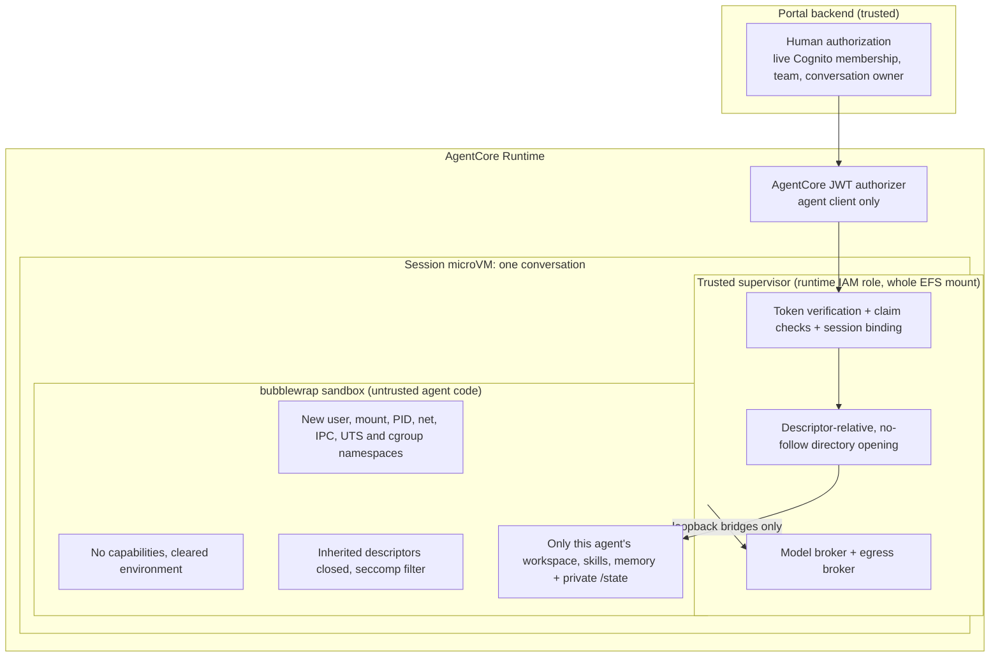

# Isolation model, verification and open security findings

This is a sample repository, not a production-ready or formally audited security boundary. We
disclose its known limitations on purpose, so that adopters can assess the implementation
accurately. Do not treat an open finding as mitigated. Do not deploy this sample unchanged where a
finding matters to your threat model.

This document covers:

- [**The isolation model**](#isolation-model): the layers that separate agents from each other,
  from AWS credentials and from the network;
- [**Verification**](#verification): what is tested, how, and what is not;
- [**Open findings**](#open-findings): the known gaps.

For how these layers fit into the request flow, see [ARCHITECTURE.md](ARCHITECTURE.md#trust-zones).
For the exact sandbox configuration, see [HARNESS.md](HARNESS.md#the-sandbox).

## Isolation model

The security goal: code run by an agent, including anything its tools execute, must not be able
to:

- read or write another agent's files or another conversation's private state;
- obtain AWS or Cognito credentials;
- reach private network destinations such as instance metadata, EFS or VPC services;
- act on data that its human could not access.



| # | Layer | What it enforces | Where |
| --- | --- | --- | --- |
| 1 | **Human authorization** | On every request, the backend rereads the human's Cognito groups, enabled status and teams. The human can use an agent only while the agent's `team_id` is one of the human's teams. Conversations, runs, replay and subscriptions also require the human to be the conversation's `owner_sub`. The dispatcher checks membership and ownership again before starting a run. | [`backend/app.py`](../backend/app.py), [`backend/events.py`](../backend/events.py) |
| 2 | **Agent identity** | Each agent is a Cognito user in the `Agents` group. The pre-token Lambda signs its single `team_id`, execution mode, security test mode and limits into its access token. AgentCore's JWT authorizer accepts only the agent client. The supervisor verifies the token again: RS256, issuer, client, `token_use`, group, and a canonical `sub`. It then requires the invocation payload to match every signed claim. | [`infrastructure/lambdas/team-claims`](../infrastructure/lambdas/team-claims/index.py), [`common/security.py`](../common/security.py), [`runtime/server.py`](../runtime/server.py) `invoke` |
| 3 | **Session binding** | Each conversation has its own runtime session ID, and therefore its own microVM. The supervisor binds itself to the first agent `sub` and conversation it serves, and rejects any other. The worker rejects requests for a different conversation. | `runtime/server.py` `invoke`, `get_worker`; `runtime/worker.py` `serve` |
| 4 | **Filesystem selection** | The verified `sub` selects `/mnt/agents/<sub>`. Every directory is opened one path component at a time, relative to its parent, with `O_NOFOLLOW`, so a symlink planted by the agent cannot redirect a mount. The sandbox receives only the agent's workspace, its skills and agent-memory directories, and a new local `/state`. The EFS root, sibling agents and `.control` are never mounted. | `common/security.py` `directory`; `runtime/server.py` `shared_mounts`, `PersistentWorker.start` |
| 5 | **Namespaces and privileges** | bubblewrap `--unshare-all` gives the worker new user, mount, PID, network, IPC, UTS and cgroup namespaces. It also applies `--cap-drop ALL` (no effective capabilities), `--clearenv` with a short allowlist, `--die-with-parent`, `--new-session`, read-only code and libraries, and private `/proc`, `/dev` and `/tmp`. At startup, a preflight bubblewrap run makes the supervisor refuse to start if namespaces are unavailable. | `runtime/server.py` |
| 6 | **Descriptor and syscall hardening** | The worker's first action is to close every inherited descriptor above stderr. It then installs a seccomp filter that denies `mount`, `umount2`, `pivot_root`, `unshare`, `setns`, `ptrace`, `open_by_handle_at`, `bpf`, `perf_event_open`, `userfaultfd`, `keyctl`, `reboot`, `kexec_load`, `init_module`, `finit_module`, `clone3`, and `clone` with any namespace flag. | [`runtime/worker.py`](../runtime/worker.py) `secure_process`, `restrict_syscalls` |
| 7 | **Network** | The sandbox's network namespace has only loopback. It can reach exactly two localhost ports, which the worker bridges to Unix sockets owned by the supervisor. There is no route to instance metadata, EFS, VPC endpoints or the internet. | `runtime/worker.py` `Bridge` |
| 8 | **Model broker** | Only `POST /v1/messages`, for the configured model alias, with allowlisted parameters, a body of at most 2 MiB, and `max_tokens` within the agent's cap. The broker calls a fixed Bedrock model with the supervisor's IAM role. The sandbox has only a placeholder API key. | [`runtime/broker.py`](../runtime/broker.py) `do_POST` |
| 9 | **Egress broker** | Only `CONNECT host:443`. It resolves the host outside the sandbox, rejects the request if **any** IPv4 result is not globally routable, connects to the validated IP without resolving again, and closes the tunnel after 240 seconds. It does not inspect content. | `runtime/broker.py` `public_target`, `do_CONNECT` |
| 10 | **Credentials** | AWS credentials, the agent JWT, table names and exporter settings stay in the supervisor. Telemetry is exported by the supervisor, not the sandbox. | `runtime/server.py`, [`runtime/telemetry.py`](../runtime/telemetry.py) |
| 11 | **Infrastructure** | The runtime and backend security groups allow outbound TCP 443 and TCP 2049 to EFS, and nothing else. EFS requires TLS and mounting through its access point. Every access through the access point runs as uid/gid 1000, and directories are created with mode 0700. | [`infrastructure/portal-stack.ts`](../infrastructure/portal-stack.ts) |

### What these layers do not protect

- **The trusted zone is broad.** The Commands Lambda and each runtime supervisor can access every
  agent's files. The runtime IAM role is shared by all agents. A compromise of the supervisor, a
  broker, a lifecycle hook or the backend is outside the sandbox boundary.
- **POSIX permissions do not separate agents.** The EFS access point makes every operation run as
  uid 1000, and all agent directories have the same owner. Separation depends entirely on what is
  mounted into each sandbox.
- **Public egress is allowed.** An agent can send any data it can read to any public HTTPS host.
  That includes shared workspace files and memory.
- **Shared by design.** All conversations of an agent share its workspace, skills and
  `MEMORY.md`, `USER.md` and `SOUL.md`. Any human on the agent's team can influence what the agent
  remembers.
- **Tools run agent-chosen code.** Terminal tools execute commands inside the sandbox. The
  boundary limits what those commands can reach; it does not limit what they do inside it.
- **Security test mode does not relax isolation.** It only exposes `SECURITY_TEST_MODE=true` to
  the agent, and only when the signed claim says so.

## Verification

### Isolation probe on the managed kernel

The sandbox depends on namespace support in the AgentCore microVM kernel, which you cannot
reproduce locally with confidence. The repository therefore includes a separate probe:

- the [`probe/`](../probe/) image;
- the `AgentSandboxIsolationProbe` stack, [`infrastructure/probe-stack.ts`](../infrastructure/probe-stack.ts),
  which uses IAM authentication, a 60-second idle timeout, a 10-minute lifetime, and the same EFS
  access-point settings.

It uses the same bubblewrap approach: `--unshare-all --cap-drop ALL --clearenv`, one workspace
bound through `/proc/self/fd`, and inherited descriptors closed before the inspector runs. It
never falls back to running without the sandbox.

[`scripts/probe_runtime.py`](../scripts/probe_runtime.py) runs three fresh sessions: write agent A,
write agent B, then read agent A. It stops each session, and writes the evidence to
`.deployment/probe-result.json`. Each session must pass every check in
[`probe/inspect_sandbox.py`](../probe/inspect_sandbox.py):

- **Namespaces and privileges:** the user, mount, PID, network, IPC and UTS namespaces are
  private; the effective capability set is zero; `no_new_privs` is set.
- **Files:** the EFS root is hidden; a sibling agent's secret file is unreadable; the supervisor's
  `/proc/<pid>/root` is unreadable; a planted symlink escape is blocked.
- **Credentials:** there are no `AWS_*` environment variables.
- **Network:** instance metadata (169.254.169.254), container metadata (169.254.170.2), a public
  address on 443 and the EFS mount targets on 2049 are all unreachable; no non-loopback interface
  is up.
- **Process state:** no descriptors were inherited; `mount()` is denied.
- **Persistence:** the agent's own workspace is writable, and agent A's marker is still there in a
  new session.

Run it with `npm run deploy:probe` and `uv run python scripts/probe_runtime.py` (see the
[README](../README.md#validate-and-deploy-the-probe)). A local Docker run is not a substitute:
Docker Desktop commonly blocks nested namespaces.

**What the probe does not test:**

- the runtime's seccomp filter. The probe installs none, so its `mount()` result comes from the
  dropped capabilities alone;
- the model and egress brokers;
- passing several descriptors into the sandbox;
- Python startup hooks ([finding 4](#finding-4--python-startup-hooks-precede-descriptor-cleanup));
- JWT and session binding.

### Unit tests

| Test | Covers |
| --- | --- |
| [`tests/test_security.py`](../tests/test_security.py) | JWT verification: issuer, expiry, client, `token_use`, group, forged signatures, a multi-team agent token, typed claims and execution mode. Egress target validation: private, loopback, link-local and metadata addresses rejected, the address pinned, and unsafe authorities rejected. Symlink and `..` traversal. Team and partition authorization. |
| [`tests/test_conversation_privacy.py`](../tests/test_conversation_privacy.py) | The runtime bubblewrap command: exactly the workspace, skills and agent directories are passed, there is no mount at `/workspace` or the old Hermes home, `HOME=/state/home`, and masked skill files are read-only. Conversation ownership. |
| [`tests/test_agent_contract.py`](../tests/test_agent_contract.py) | Rejection of requests for another conversation. `secure_process` runs before the adapter is imported. The full supervisor-to-worker JSONL path through the Echo adapter. |
| [`tests/test_execution_mode.py`](../tests/test_execution_mode.py) | A signed identity blocks an execution-mode override. The EFS lock is skipped only in concurrent mode. |
| [`tests/test_sandbox.py`](../tests/test_sandbox.py) | The probe launcher: subject validation, symlink rejection, descriptor closing, and a single sandbox attempt. |

**Not covered by automated tests:**

- whether the seccomp rules are actually enforced;
- the runtime's namespace and capability flags;
- the broker's rejection paths (wrong model, extra parameters, `max_tokens` over the cap, a body
  that is too large);
- the 403 responses from session binding.

On Linux hosts that allow unprivileged user namespaces, `scripts/check_echo_sandbox.py` exercises
the real bubblewrap, bridge and worker path (see [HARNESS.md](HARNESS.md#verification)).

## Open findings

The findings below are still unresolved in the source. They keep the numbers from the project's
security review, which is why the list does not start at 1.

| Finding | Severity | Status |
| --- | --- | --- |
| [4 — Python startup hooks precede descriptor cleanup](#finding-4--python-startup-hooks-precede-descriptor-cleanup) | High impact, if an installed dependency is compromised | Open |
| [5 — Completed workers retain execution and broker access](#finding-5--completed-workers-retain-execution-and-broker-access) | Medium | Open |
| [6 — Settings updates can undo team transfers](#finding-6--settings-updates-can-undo-team-transfers) | Medium | Open |
| [7 — Team transfers leave old-team execution active](#finding-7--team-transfers-leave-old-team-execution-active) | Medium | Open |

## Finding 4 — Python startup hooks precede descriptor cleanup

**Status:** Open.

**Assessment:** High impact, but only if a dependency or startup customization installed in the
agent image is compromised. An ordinary prompt, or a change to the writable workspace, is not
enough to exploit it.

### Mechanism and impact

[`PersistentWorker.start()`](../runtime/server.py) launches `/opt/venv/bin/python -I` inside
bubblewrap. It passes three outer directory descriptors through `pass_fds`, which bubblewrap uses
to mount the agent's workspace, skills and agent-memory directories.
[`secure_process()`](../runtime/worker.py) closes descriptors above stderr and installs seccomp
when `worker.py` enters `main()`.

Python can run installed `.pth` import hooks, or equivalent site customization, before it runs
the script. `-I` disables user site-packages and ignores Python environment variables, but it does
not disable startup hooks in the interpreter's installed environment. Editable installs, such as
the Hermes `pip install -e`, normally create such a `.pth` file. The order is:

```text
bubblewrap establishes namespaces and mounts
  -> agent-environment Python starts and processes installed startup hooks
  -> worker.py closes inherited descriptors and installs seccomp
  -> adapter imports and normal agent execution begin
```

A malicious startup hook could use one of those outer descriptors that is still open. By
traversing parent directories relative to it, the hook could reach EFS paths outside the sandbox's
bind mounts: other agents' files, and other conversations' snapshots under `.control/`.
Filesystem permissions do not limit this. Every EFS operation runs as uid 1000 through the access
point, and all agent directories have the same owner.

Closing the descriptors later cannot undo access that already happened. The read-only image
mounts stop ordinary agent tools from changing the installed environment, but they cannot stop a
startup hook that was already in the image. The namespaces are already in place at this point.
The gap is the inherited filesystem capabilities, and the fact that seccomp is installed late.

## Finding 5 — Completed workers retain execution and broker access

**Status:** Open, Medium. Reusing persistent workers is intentional. The gap is that background
execution can continue outside the sequential reservation.

**Prerequisite:** Code execution inside an admitted agent sandbox, enough to start a background
thread or subprocess and then let the foreground turn finish normally.

### Mechanism and impact

After it emits a completed result, [`worker.serve()`](../runtime/worker.py) keeps the adapter
alive. [`execute()`](../runtime/server.py) keeps successful workers, but releases the agent-wide
EFS execution lock, and the terminal transaction releases the DynamoDB reservation. Background
work can therefore keep modifying shared files while another conversation holds the exclusive
lock. The finished turn's pipe-reader deadline no longer applies to that work.

The brokers also keep serving until the worker closes:

- [`Handler.do_POST()`](../runtime/broker.py) accepts model requests without checking that a run
  owned by the supervisor is active;
- `do_CONNECT()` still opens public egress tunnels.

This bypasses the guarantee that shared files are changed by only one execution at a time. It
also allows model use and egress outside an active run. The model-selection and per-request
output limits still apply, and the session's idle timeout (15 min) and maximum lifetime (8 h)
eventually end the execution. This finding does not by itself expose another conversation's
private files. Making `USER.md` agent-scoped does not address this gap.

## Finding 6 — Settings updates can undo team transfers

**Status:** Open, Medium.

**Prerequisite:** A settings request authorized for the old team overlaps an administrator's
transfer of the agent to another team. Exploiting it requires winning this timing window.

### Mechanism and impact

[`Services.update_agent_limits()`](../backend/service.py) receives the agent record that was
authorized earlier. It performs Cognito operations, then replaces the whole DynamoDB record with
`put_item(Item=agent)`. [`Services.update_account()`](../backend/service.py) can transfer the agent
between that first read and the write:

```text
settings request reads and is authorized for team A
  -> administrator transfers agent to team B
  -> settings request writes its stale complete record, restoring team A
```

This restores old-team access to the agent's shared files and removes the destination team's
access. Afterwards, Cognito and DynamoDB can disagree: the token's `team_id` is B, but the record
says A. The runtime then rejects dispatch with 403. The initial authorization checks and later
strongly consistent reads do not prevent the stale overwrite. Restricting client-writable
attributes does not help, because this race happens in the privileged backend.

## Finding 7 — Team transfers leave old-team execution active

**Status:** Open, Medium.

**Prerequisite:** An old-team user starts a task before an administrator transfers the agent. The
confidentiality impact is greatest for concurrent agents, where destination-team work can start
while the old task is still running.

### Mechanism and impact

[`Services.update_account()`](../backend/service.py) changes the agent's team and signs its
Cognito identity out everywhere. It does not stop existing producers or their sandbox mounts.
[`RunStore.heartbeat()`](../common/runs.py) checks the run's status, writer ownership and deadline,
but not whether the team is still authorized. A healthy producer can therefore keep running after
the transfer.

A task directed by the old team keeps write access to the shared workspace. With concurrent
execution, it could watch new destination-team files and send their contents to a permitted
public endpoint. This is about execution continuing across a transfer. It is not about the
intended sharing of the agent's `MEMORY.md`, `USER.md` and `SOUL.md` within the team that is
currently authorized.

The protections that still apply:

- current-team checks deny the removed user's new API requests;
- conversation-owner checks still protect private replay.

Global sign-out alone does not stop code that is already running. Before relying on transfers,
validate that a transfer racing with run admission cannot leave old-team code running against the
newly assigned workspace, including for concurrent agents.
