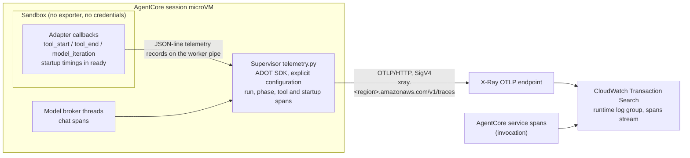

# Agent OpenTelemetry tracing

The AgentCore runtime exports OpenTelemetry traces. For each run, they show where the time went:
worker startup, model calls, tool calls, DynamoDB writes and the final commit. They also show token
usage and how the run ended. They do **not** contain prompts, responses or tool data. This
document explains:

- how the tracing pipeline is built;
- what each span means and how to read its duration;
- where to find traces in CloudWatch;
- what the deployment needs before traces appear.

For where these spans fit in the overall execution flow, see
[HARNESS.md](HARNESS.md#telemetry-and-logging).

## Pipeline



- **Where the SDK runs.** The trusted supervisor runs AWS Distro for OpenTelemetry (ADOT)
  0.18.0, installed in `/harness-venv` from [`runtime/requirements.txt`](../runtime/requirements.txt).
  [`runtime/telemetry.py`](../runtime/telemetry.py) configures it explicitly at startup. Library
  auto-instrumentation is not used, so no library can inspect request bodies without our
  knowledge.
- **How spans are exported.** Spans go over OTLP/HTTP to the regional X-Ray endpoint, signed with
  the runtime role (`xray:PutTraceSegments`, `xray:PutTelemetryRecords`). With
  `UNIFIED_TRACES_DESTINATION_ENABLED=true`, CloudWatch Transaction Search stores them as
  structured spans in the runtime's log group, in its `spans` stream.
- **What the sandbox sends.** Nothing is exported from the sandbox. The adapter only emits small
  telemetry records on the pipe it already uses. The supervisor filters and bounds those records
  before turning them into spans.
- **Sampling and flushing.** Every trace is sampled (`OTEL_TRACES_SAMPLER=always_on`). The batch
  processor exports every second (`OTEL_BSP_SCHEDULE_DELAY=1000`). After each run, and at shutdown,
  the supervisor flushes with a three-second limit. A failed flush only logs a warning; it never
  changes the run's result.

## What is traced

| Span | Emitted by | Meaning |
| --- | --- | --- |
| `invoke_agent <adapter-id>`, for example `invoke_agent hermes-v1` | Supervisor | The whole background turn, from session lookup to the committed result. `gen_ai.agent.name` is the adapter ID from the trusted manifest. |
| `agentcore.session.lookup` | Supervisor | Reading the conversation record from DynamoDB |
| `agentcore.workspace.prepare` | Supervisor | Opening the agent's EFS directories, and taking the execution lock in sequential mode |
| `agentcore.worker.acquire` | Supervisor | Reusing or starting the worker. `agentcore.worker.reused` is true for a warm turn. |
| `agentcore.worker.turn` | Supervisor | From sending the request to the worker until its result arrives |
| `chat <model alias>` | Model broker | One broker request to Bedrock, including the whole response stream |
| `execute_tool <tool name>` | Supervisor, from adapter callbacks | A tool call as observed by `tool_start`/`tool_end` callbacks |
| `agentcore.event.persist` | Supervisor | One fenced DynamoDB event append |
| `agentcore.heartbeat` | Supervisor | Refreshing the run's heartbeat |
| `agentcore.lifecycle.after_turn` | Supervisor | The optional trusted host hook. Hermes publishes its snapshot here. |
| `agentcore.run.finalize` | Supervisor | Writing the final chunks and committing the terminal transaction |
| `agentcore.completion.commit` | Supervisor | The terminal DynamoDB transaction itself |
| `agentcore.worker.discard` | Supervisor | Stopping a worker that cannot be reused after an error |
| AgentCore invocation spans | AgentCore service | The short `start` request, up to its acknowledgement |

Where spans nest:

- The run span is the parent of everything.
- Persistence and heartbeat spans written *during* the turn are children of `agentcore.worker.turn`,
  alongside the model and tool spans.
- Final-chunk and commit writes are children of `agentcore.run.finalize`.

The cold-start subtree is described [below](#cold-worker-acquisition-breakdown).

### Attributes

- **Correlation.** Every span carries these attributes, so you can filter by any of them:
  - `session.id` (the runtime session);
  - `gen_ai.conversation.id`;
  - `gen_ai.agent.id`;
  - `agentcore.run.id`.
- **Run span.**
  - The final `agentcore.run.status`.
  - `agentcore.execution_mode`.
  - `agentcore.model_calls`: the number of broker requests.
  - `agentcore.iterations`: the highest framework iteration reported.
  - The summed `gen_ai.usage.input_tokens` and `output_tokens`.
  - For a partial run, `gen_ai.response.finish_reasons`.
  - The span status is OK only for `complete`. A `partial` run is not a success, even though its
    output was saved.
- **Model span.**
  - `gen_ai.request.model` is the Bedrock model ID. The span *name* uses the client-facing alias.
  - `gen_ai.request.max_tokens` and `agentcore.model.streaming`.
  - The input and output token counts reported by the provider.
  - Separate cache counts: `aws.bedrock.usage.cache_read_input_tokens` and
    `aws.bedrock.usage.cache_creation_input_tokens`.
  - `error.type` if the call failed.
- **Tool span.**
  - `agentcore.tool.timing=callback_observation`.
  - Tool names come from an allowlist; other names are reported as `other`.
  - An end with no matching start is ignored. A matched end sets
    `agentcore.tool.lifecycle=result_available`, which means a result was produced, not that the
    tool succeeded.
  - A span still open at the end of the turn is closed with `agentcore.tool.lifecycle=unresolved`.
  - At most 128 tool spans can be open at once.
- **Parent context.**
  - The supervisor prefers a valid `X-Amzn-Trace-Id` from AgentCore (at most 512 characters). It
    falls back to W3C `traceparent`/`tracestate`.
  - Header names are matched without regard to case.
  - Incoming baggage is never copied.
  - `agentcore.trace.parent_source` records which parent was used: `xray`, `w3c`, `missing` or
    `local`.

The turn runs as a background task, so it keeps its own trace context after the start request
has been acknowledged. Broker threads receive an explicit snapshot of that context for each turn.
Clearing one turn's context can never clear a newer turn's.

### Interpreting durations

A parent's duration is generally **not** the sum of its descendants. Nested spans overlap, and
parallel calls overlap each other. Compare a parent's duration with the **union of its direct
children's intervals**, not with the sum of the whole tree.

Worker startup or reuse, EFS setup, the optional host lifecycle work and the DynamoDB writes each
have their own span, so none of that time is hidden inside the agent span. The time in
`agentcore.worker.turn` that is not covered by a child span is framework orchestration, parsing
and preparation. Do not read it as model inference or tool execution time.

Tool spans measure when the adapter's callbacks were **observed**. Callbacks for tools running in
parallel may arrive after the whole batch finishes. Tool spans are therefore not exact tool
latency.

`AgentCore.Runtime.Invoke` measures only the short start request, up to its acknowledgement. The
agent turn continues afterwards, so the child `invoke_agent` span usually outlives the invocation
span. They still share trace context. The service's invocation spans can be stored in `aws/spans`,
while the application spans are in the runtime's log group. Query both when you check end-to-end
correlation.

### Cold worker acquisition breakdown

Expand `agentcore.worker.acquire` to see where cold-start time goes:

| Span | What it measures |
| --- | --- |
| `agentcore.worker.local_state` | Creating the private temporary directories |
| `agentcore.lifecycle.before_start` | The optional trusted integration hook. Hermes restores its snapshot here; Echo does nothing. |
| `agentcore.brokers.start` | Starting the trusted model and egress brokers |
| `agentcore.mounts.prepare` | Opening the verified shared workspace and skill directory descriptors |
| `agentcore.worker.bootstrap` | From launching the subprocess until the worker's `ready` message is received |
| ↳ `agentcore.process.launch` | The supervisor's subprocess-creation call. Namespace and interpreter setup may continue after it returns. |
| ↳ `agentcore.worker.security` | Closing inherited descriptors and installing seccomp in the worker |
| ↳ `agentcore.worker.bridges` | Starting the loopback-to-Unix-socket bridges in the sandbox |
| ↳ `agentcore.adapter.imports` | Importing the selected adapter module |
| ↳ `agentcore.adapter.initialize` | Adapter configuration, framework imports and conversation setup |

How the worker stages are measured:

- The worker records their timestamps itself and sends them in its `ready` message. They are not
  inferred from when the supervisor receives that message. Both processes use the same VM clock.
- The supervisor accepts only known stage names, at most once each, as non-overlapping intervals
  inside the bootstrap window it observed. It then creates them as child spans of the bootstrap
  span.
- It ignores malformed measurements. They never block an otherwise valid `ready`.
- Only timings and success/error flags are exported: no configuration, and no private content.

Bootstrap time outside the worker stages includes bubblewrap, the Python interpreter and standard
library start-up, IPC delivery and scheduling. The whole bootstrap must finish within 30 seconds.
Warm turns skip startup and have no cold-start child spans.

`agentcore.lifecycle.after_turn` measures only the optional host hook that runs before
finalization. The Hermes snapshot itself is created inside the adapter's turn. The harness has no
snapshot spans of its own.

A partial outcome is marked as non-success, with its exit reason and iteration count. For
example, `max_iterations_reached` means Hermes used up its 20-iteration loop budget. That budget is
separate from the one-hour execution deadline. `agentcore.model_calls` counts actual broker
requests, which is not necessarily the same as Hermes' logical iterations.

## Privacy and sandbox boundary

Application spans never intentionally capture:

- prompts, response text, or tool arguments and results;
- private memory;
- credentials or authorization headers.

The adapter's telemetry records travel over the worker pipe. The supervisor then:

- keeps only allowlisted event types, bounded call IDs, allowlisted tool names and numeric fields;
- limits exit reasons to `[a-z_]{1,64}`;
- drops everything else.

The protocol does not stop an adapter from putting other fields into a record, but they are never
exported. Telemetry records are also never saved as chat events.

The sandbox does **not** run an exporter, does not receive AWS credentials, and gains no network
access for telemetry.

Content capture is also disabled in configuration:

- `OTEL_INSTRUMENTATION_GENAI_CAPTURE_MESSAGE_CONTENT=false`;
- automatic logging instrumentation is off;
- the OTLP metrics and logs exporters are set to `none`.

Native AgentCore service metrics and the process's stdout/stderr logs continue as normal.

When observability is enabled, the supervisor logs JSON records named `agent.turn.started` and
`agent.turn.finished` (with the status). They contain `run_id` and `trace_id`, but no message
content. Worker stderr, including framework output, is discarded unless `WORKER_DEBUG=1` is set.
Only use that setting for diagnosis, because it can log agent content.

## Where to look

Open CloudWatch in your deployment region:

1. **GenAI Observability → Bedrock AgentCore** for views of agents, sessions and traces.
2. **Application Signals → Transaction Search**, filtered by service **`agent-harness`**.
3. **Logs Insights** on `/aws/bedrock-agentcore/runtimes/<RUNTIME_ID>-DEFAULT` for the structured
   spans in its `spans` stream. The stack output `RuntimeId` gives the runtime ID. For example:

```text
fields @timestamp, @message
| filter @message like /YOUR_RUN_UUID/
| sort @timestamp asc
| limit 100
```

To start from a user-visible run, search the same log group's supervisor output for
`agent.turn.started` or `agent.turn.finished` and the run UUID. That gives you the trace ID. Open
the trace in Transaction Search.

X-Ray trace-summary indexing is a separate, account-level setting, which this stack does not
change. If a trace is missing from the X-Ray summary views, use Transaction Search or Logs Insights
instead.

## Deployment configuration

[`infrastructure/portal-stack.ts`](../infrastructure/portal-stack.ts) configures tracing as
follows:

- **Runtime environment.** `AGENT_OBSERVABILITY_ENABLED=true`, `OTEL_SERVICE_NAME=agent-harness`,
  `OTEL_TRACES_EXPORTER=otlp`, `OTEL_EXPORTER_OTLP_PROTOCOL=http/protobuf`,
  `OTEL_EXPORTER_OTLP_TRACES_ENDPOINT=https://xray.<region>.amazonaws.com/v1/traces`,
  `OTEL_TRACES_SAMPLER=always_on` and `UNIFIED_TRACES_DESTINATION_ENABLED=true`. Metrics and logs
  exporters and Application Signals are disabled.
- **IAM.** `xray:PutTraceSegments` and `xray:PutTelemetryRecords`, plus `logs:PutResourcePolicy`
  on log groups matching `/aws/bedrock-agentcore/runtimes/agent_sandbox_portal-*`, so that AgentCore can
  authorize delivery of unified spans.
- **Log delivery.** A `TRACES` delivery source for the runtime, an `XRAY` delivery destination,
  and the delivery that connects them.

**Account prerequisites.** Each target account and region needs two settings that are not part of
this stack:

- CloudWatch Transaction Search must be enabled, with span destination status
  `CloudWatchLogs / ACTIVE`;
- an X-Ray-to-CloudWatch Logs resource policy must exist.

Check both before you deploy. See:

- https://docs.aws.amazon.com/bedrock-agentcore/latest/devguide/observability-configure.html
- https://docs.aws.amazon.com/AmazonCloudWatch/latest/monitoring/Enable-TransactionSearch.html

To verify tracing, start a fresh conversation, send a message, and look up its run UUID as
described above. Unified storage does not change the content-capture policy: prompts and
responses are still not captured.
