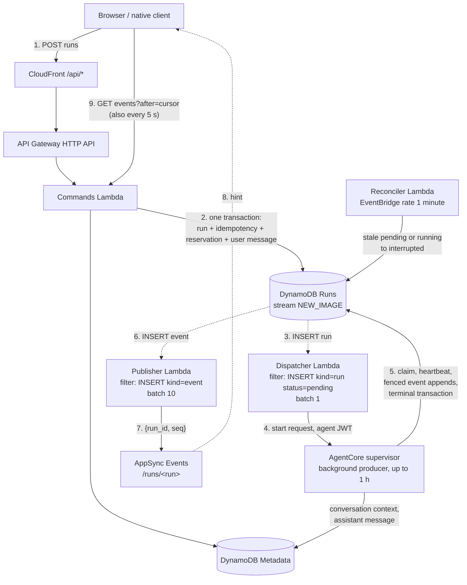
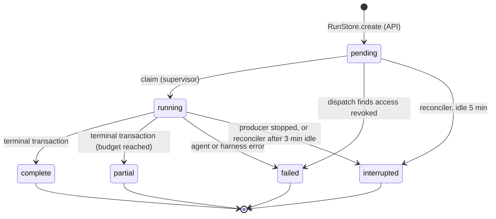

# Serverless run pipeline

This document explains how a chat message becomes a durable **run**, how that run reaches the
AgentCore runtime, and how its output gets back to clients. It covers the DynamoDB records, the
Lambda functions triggered by the stream, the retry and recovery rules, and the client API.
For the overall picture, read [ARCHITECTURE.md](ARCHITECTURE.md) first. For what happens inside
the runtime session, see [HARNESS.md](HARNESS.md).

- [Design in one paragraph](#design-in-one-paragraph)
- [Data flow](#data-flow)
- [Run lifecycle](#run-lifecycle)
- [DynamoDB records](#dynamodb-records)
- [Writes, fencing and retries](#writes-fencing-and-retries)
- [Recovery](#recovery)
- [Client API](#client-api)
- [Authentication](#authentication)
- [Operations](#operations)
- [Scaling boundaries](#scaling-boundaries)

## Design in one paragraph

DynamoDB is the single source of truth. The API Lambda records a run and returns immediately. The
DynamoDB stream acts as an outbox: a new run record triggers dispatch, and a new event record
triggers a notification. The AgentCore supervisor runs the turn in the background for up to an
hour and appends each piece of output as an immutable, numbered event. AppSync only tells clients
that something new exists. Clients always read content through the authorized replay API, and
they poll as a fallback. No Lambda function and no client connection owns the turn, so a turn
survives browser disconnects and Lambda timeouts.

## Data flow

The numbered steps:

1. The client sends `POST /api/agents/{agent}/conversations/{conversation}/runs` with an
   `Idempotency-Key` header.
2. The Commands Lambda checks the human's current team membership and conversation ownership. It
   then calls `RunStore.create()` ([`common/runs.py`](../common/runs.py)). This single transaction:
   - inserts the pending run;
   - inserts the idempotency record;
   - takes the reservation (per agent in sequential mode, per conversation in concurrent mode);
   - writes the user message and the `CLIENT#` record;
   - updates the conversation's `latest_run_id`.

   The Lambda returns the run immediately. If the reservation is already held, the request fails
   with 409 "This agent already has an active run" (or "This conversation…" in concurrent mode).
   The client waits for the current run to finish before sending again.
3. The committed run insert appears on the Runs table stream. The dispatch consumer handles only
   `INSERT` records where `kind=run` and `status=pending`.
4. `dispatch()` ([`backend/events.py`](../backend/events.py)) does the following:
   1. Rereads the run, and stops if it is no longer pending.
   2. Rechecks that the human is still on the agent's team, marking the run `failed` if not.
   3. Checks that the execution mode still matches.
   4. Reads the agent's password from Secrets Manager and calls Cognito `AdminInitiateAuth` to get
      a 15-minute agent access token.
   5. Calls `POST https://bedrock-agentcore.<region>.amazonaws.com/runtimes/<arn>/invocations?qualifier=DEFAULT`
      with that token as the bearer and the conversation's `X-Amzn-Bedrock-AgentCore-Runtime-Session-Id`.
      The body is `{operation: "start", run_id, conversation_id, team_id, message, ...signed settings}`.

   The request times out after 20 seconds. The supervisor acknowledges after it claims the run,
   and the turn continues without the dispatcher. Any error, including an unexpected HTTP status
   such as 409 "Agent is busy" from a session that is still finishing a turn, fails that stream
   record. The stream then retries it (see [retries](#writes-fencing-and-retries)).
5. The supervisor claims the run, streams the agent's output into `EVENT#` records, sends a
   heartbeat about every 15 seconds, and finally commits the terminal transaction. See
   [HARNESS.md](HARNESS.md#dynamodb-coordination-and-event-delivery).
6. Each committed event insert appears on the stream. The publish consumer handles only `INSERT`
   records where `kind=event`.
7. `publish()` groups the records by run and publishes one `{run_id, seq}` hint per run, with the
   highest sequence number seen, to channel `/runs/<run>`. It signs the request with its IAM role.
8. AppSync delivers the hint to subscribed clients.
9. The client reads `GET .../runs/{run}/events?after=<cursor>`. It also does this on a five-second
   timer, whether or not a hint arrives.

Nothing in this path holds a long request open. The Commands Lambda times out after 29 s, the
Dispatcher after 60 s and the Publisher after 30 s. The hour-long work is a background task in the
AgentCore supervisor. While that task runs, the supervisor reports `HealthyBusy` on `/ping`, so
AgentCore keeps the session alive. In sequential mode the task also holds the agent's EFS
execution lock. The sandboxed agent process cannot reach DynamoDB or AppSync.

## Run lifecycle

- **`pending`**: accepted, and not yet claimed by a supervisor.
- **`running`**: claimed. The run has a random `owner` token and a fixed `deadline` 3,720 seconds
  after the claim.
- **`complete` / `partial`**: the agent returned a result. `partial` means a framework budget was
  reached, for example Hermes' 20-iteration limit. The partial text is still saved and shown.
- **`failed`**: the agent or harness reported an error, or access was revoked before dispatch.
- **`interrupted`**: execution stopped without a result. The supervisor may have stopped, the
  worker may have exited, or the reconciler judged the run stale.

Every terminal status releases the run's reservation. Only `complete` and `partial` also write the
assistant message to history and commit `adapter_state` (see below).

## DynamoDB records

Most records are written through `RunStore` in [`common/runs.py`](../common/runs.py). The
exception is subscription tickets: the backend writes them with a plain `PutItem`
([`backend/app.py`](../backend/app.py)).

| Table | Key (`pk / sk`) | Purpose |
| --- | --- | --- |
| Runs | `RUN#<run> / META` | Run identity, message, status, `owner` token, `last_event_id` cursor, `updated_at`, `deadline`, and optional completion metadata |
| Runs | `RUN#<run> / EVENT#<20-digit seq>` | One immutable replay event. Its insert drives the publisher. |
| Runs | `IDEMP#<derived key> / META` | Maps human + agent + conversation + `Idempotency-Key` to a run ID and a digest of the message |
| Runs | `AGENT#<agent> / LOCK` | Sequential-mode reservation: the one active run for this agent |
| Runs | `CONVERSATION#<agent>#<conversation> / LOCK` | Concurrent-mode reservation: orders turns within one conversation |
| Runs | `TICKET#<sha256> / META` | A two-minute AppSync subscription ticket, scoped to one run. Only its hash is stored. |
| Metadata | `AGENT#<agent> / CONV#<conversation>` | Owner `owner_sub`, `runtime_session_id`, `latest_run_id`, and optional opaque `adapter_state` |
| Metadata | `MESSAGES#<agent>#<conversation> / MSG#<seq>#0` or `#1` | User message (`#0`) and assistant message (`#1`), with `run_id` |
| Metadata | `CLIENT#<human> / SESSION#<conversation>` | Mapping from the human to the conversation, and the latest run |

The Runs table has a `WorkByStatus` index (partition `status`, sort `updated_at`), which the
reconciler queries. Reservations have no TTL. A reservation is removed only by the run's own
terminal transaction, or by the reconciler's conditional interruption. It is never taken over
because it looks old.

## Writes, fencing and retries

**No dual write.** The run insert is itself the dispatch message. There is no separate queue write
that could fail after the database write succeeds. If dispatch fails, the stream retries the same
record, and therefore the same run ID.

**Claim once.** `claim()` changes `pending` to `running` only if the run is still pending and has
not expired. A run that is already `running` is never executed again, even after its supervisor
stops. The agent's tools may already have had side effects, so running it twice could repeat them.

**Fenced appends.** Each `append()` is a DynamoDB transaction that inserts `EVENT#<seq>` and
updates the run. It succeeds only if the run's status, `last_event_id`, `updated_at` and `owner`
are still what the writer last saw. If the reconciler, or anyone else, changes the run, the next
write from the old producer fails with `LostOwnership` and that producer stops.

**Terminal transaction.** For `complete` and `partial`, one transaction does all of the following:

- inserts the terminal event;
- writes the run's final status and `adapter_state`;
- deletes the reservation;
- inserts the assistant history message (only once, keyed by sequence);
- updates the conversation's `adapter_state`.

`failed` and `interrupted` transitions write the terminal event and release the reservation, and
nothing else. The final text is replayed as `final_chunk` events of up to 8,192 characters,
written before the terminal event. The history message is written once, with its `run_id`.

**Retries.**

- **Transaction conflicts:** when a transaction is cancelled only because of `TransactionConflict`,
  the writer rereads the run with a strongly consistent read. If the fencing values are unchanged,
  it retries the same transaction, up to three times, with exponential jitter.
- **Ambiguous responses:** if an append response is lost, a retry that finds the matching event
  already written treats it as written.
- **Everything else**, including exhausted transport timeouts, takes the conservative path: the
  producer stops, and the run ends up `interrupted`. The reasoning is recorded in
  [review decisions 4A/4B](../specs/session-gateway/DECISIONS.md).
- **Stream consumers:** both report per-record batch failures, bisect a failing batch, retry each
  record up to three times, discard records older than one hour, and then send failures to an SQS
  queue.
- **Reconciler:** asynchronous invocations are retried twice, with a five-minute maximum event age
  and a failure queue.

## Recovery

**Reconciler.** Every minute, `reconcile()` queries `WorkByStatus` for:

- `pending` runs whose `updated_at` is more than five minutes old: never claimed, for example
  because dispatch kept failing;
- `running` runs whose `updated_at` is more than three minutes old: no heartbeat and no event for
  three minutes.

It rereads each candidate with a strongly consistent read, then conditionally appends an
`interrupted` event and releases the reservation. A concurrent heartbeat or completion makes that
condition fail, and the healthy run continues. The reconciler never resumes a run and never
removes the EFS execution lock. In sequential mode, a new run therefore cannot touch shared files
until the old worker has really exited and released its `flock`. Concurrent mode deliberately
allows simultaneous shared-file writes from different conversations.

**What each failure means for the user**

| Failure | Outcome |
| --- | --- |
| Browser closes or loses its network | The turn continues. The client resumes replay from its cursor. |
| AppSync is down or a hint is lost | Events are still persisted. The five-second poll finds them. |
| Dispatch keeps failing | The stream retries, then the failure queue. The reconciler interrupts the run after five minutes. |
| Supervisor or microVM stops mid-turn | Committed events remain. The reconciler interrupts the run after three minutes. In-flight agent state since the last snapshot is lost. |
| Terminal commit fails | The worker is discarded, and no success is recorded. The run becomes `failed` or `interrupted`, depending on the error, either directly or through the reconciler. |
| Run older than 7 days | Replay returns 410. Conversation history is still available. |

**Agent snapshots are Hermes-specific.** The generic pipeline commits only an opaque
`adapter_state` dictionary (at most 4 KiB). Hermes uses it to store a pointer to an immutable
SQLite snapshot on EFS, `.control/<agent-sub>/<conversation>.<run>.db`, which its trusted
lifecycle module publishes and fsyncs *before* the terminal transaction. The pointer is committed
together with the result, so a stale or interrupted run can never make its snapshot the
authoritative one. A crash between publishing the file and committing leaves an unreferenced file,
which is harmless. Other agents, such as Echo, commit no state at all. Shared workspace changes and
external tool effects are never rolled back. See [HARNESS.md](HARNESS.md#hermes-snapshots).

**Retention.** Run, event and idempotency records expire after seven days. TTL deletion is
asynchronous, so read paths also check the expiry themselves. Conversation history, conversation
metadata and Hermes snapshots are kept separately and do not expire.

## Client API

All paths are under `/api`. Every request is authorized again, using the human's current Cognito
membership and the conversation's `owner_sub`.

| Method and path | Purpose |
| --- | --- |
| `GET`, `POST /api/agents/{agent}/conversations` | List your conversations with this agent, or create one. The returned UUID identifies the conversation. |
| `POST {base}/runs` (header `Idempotency-Key`, body `{message}`) | Submit a message. Returns the run. |
| `POST {base}/runs/{run}/subscription` | Get an AppSync endpoint, host, channel `/runs/{run}` and a two-minute ticket |
| `GET {base}/runs/{run}/events?after=N` | Ordered events after sequence `N`: at most 100 per page, with `has_more` |
| `GET {base}/runs/{run}` | Run status |
| `GET {base}/runs/active` | The conversation's latest run, which may already be terminal, or `null` |
| `GET {base}/messages?cursor=…` | Conversation history as `{messages, next_cursor}`: at most 100 messages or about 2 MiB of JSON per page |
| `POST {base}/chat` | Returns 410. This was the old streaming endpoint. |

Here `base` is `/api/agents/{agent}/conversations/{conversation}`.

**Sending a message.**

1. Generate an `Idempotency-Key` and keep it until the server accepts the run. The browser client
   stores it in `localStorage`. If the network fails and you do not know whether the request
   arrived, resend with the same key. The same key with a different message returns 409.
2. Request a subscription ticket. Connect with the AppSync Events WebSocket protocol, and subscribe
   to the run's channel.
3. Fetch replay from your cursor (`after=0` for a new run). Follow `has_more` until the pages run
   out. Advance the cursor only over contiguous sequence numbers, and ignore duplicates.
4. Treat each hint `{run_id, seq}` only as a reason to fetch replay again. Poll every few seconds
   anyway, because hints can be lost or duplicated.
5. Stop when you have replayed through `last_event_id` and the run status is terminal.

The reference implementation is [`frontend/src/runClient.ts`](../frontend/src/runClient.ts).
[`frontend/src/streamState.ts`](../frontend/src/streamState.ts) shows how the events are turned
into text:

- `delta` appends to the current text;
- `segment_end` turns the current text into a "Latest work update";
- `final_chunk` builds the final answer;
- `status` updates the progress line.

**Reloading.** Read `GET {base}/runs/active` before and after walking all the history pages. If
the latest-run pointer changed during the walk, walk the history again. Deduplicate history and
replay by `run_id` and role, and require the selected run's user message to be present before
attaching to the run. A cursor is useful only if you still have the content it points to; a new
client should replay from zero. After a run finishes, check `runs/active` again for a newer run
before enabling sending.

**Privacy.**

- Only the human who created a conversation can list, read, send, replay or subscribe to it, and
  only while they are still on the agent's team.
- Other humans, including administrators, cannot see it.
- Conversation records without an owner are hidden.
- To reconnect from a second device, sign in as the same human.
- Files are different: the agent's workspace, skills and `MEMORY.md`, `USER.md` and `SOUL.md` are
  shared by all of that agent's conversations.

## Authentication

**Browser.** The portal uses an opaque, same-origin cookie named `__Host-agent-sandbox-session`. It is
Secure, HttpOnly, SameSite=Lax and lasts eight hours. The backend stores only a SHA-256 hash of the
cookie value, in Metadata. Requests that change state and carry the cookie must also send the
portal's `Origin`. Human login is described in
[ARCHITECTURE.md](ARCHITECTURE.md#1-log-in).

**Native clients.** Send a human Cognito **ID token** as `Authorization: Bearer ...`. State-changing
requests are accepted this way only if they carry no cookie and no `Origin` header. If a cookie is
present, the browser rules still apply. To create a public mobile OAuth client, set the CDK
context `mobileCallbackUrls` to an array. The app should use authorization code + PKCE (S256)
through the system browser, and keep tokens in the operating system's secure storage. No native
app is included; both kinds of client use the same API.

**Subscriptions.** Tickets are random, stored only as a hash, scoped to one run, and expire after
two minutes. Connecting checks the ticket's expiry and the human's current membership. Subscribing
also requires the exact channel `/runs/<run>`; wildcards are rejected. Clients cannot publish;
publishing requires IAM. The authorizer never caches results. A socket that is already connected
receives only opaque hints, so if a human loses membership, they learn nothing more: their next
replay request is refused. Never log tokens or ticket values.

## Operations

The stack creates these CloudWatch alarms. None of them has an action configured, so attach an SNS
topic or your paging system:

- Lambda `Errors` and `Throttles` for Commands, EventsAuthorizer, Reconciler, Dispatcher and
  Publisher;
- stream `IteratorAge` above 60 seconds, and `DestinationDeliveryFailures`, for both stream
  consumers;
- visible messages in any of the three failure queues. The queues keep messages for 14 days.

Also watch these, which have no alarms: DynamoDB throttling, AppSync delivery errors, and
AgentCore and Bedrock quotas.

## Scaling boundaries

The Commands Lambda is stateless and scales with no affinity to any run. Each run has its own
DynamoDB partition and its own AppSync channel. An agent's execution mode is fixed when the agent
is created. It is signed into the agent's token, and neither a chat payload nor the settings API
can change it:

- **Sequential** (default): one active run per agent. This is enforced by the DynamoDB agent
  reservation and the EFS lock.
- **Concurrent:** one active run per conversation. Different conversations of the same agent run
  in parallel, each in its own AgentCore session.

Overall throughput is limited by your account's Lambda concurrency, AgentCore session and Bedrock
model quotas, DynamoDB capacity, and the capacity of the `WorkByStatus` index.
